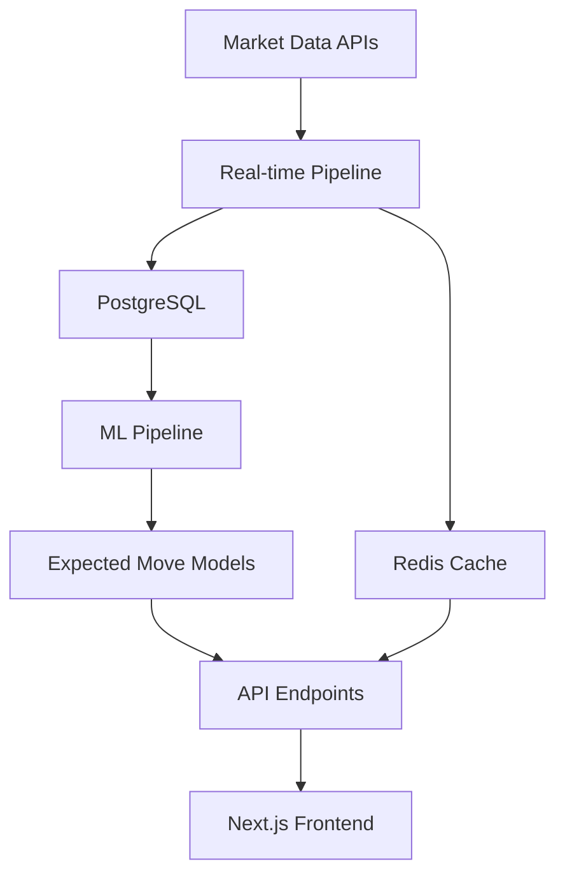

# Quantiv 📈

> **See tomorrow's moves today**

Quantiv is a modern options trading analytics platform that provides ML-powered expected move forecasting and real-time market intelligence. Built for traders who need precision and speed in options markets.


## ✨ Features

### 🔮 Predictive Analytics
- **ML-Powered Expected Moves**: Advanced forecasting using historical options data
- **Confidence Bands**: 68% and 95% probability ranges for price movements  
- **Earnings Impact Analysis**: Specialized models for earnings-driven volatility
- **Real-time Model Updates**: Continuous learning from market data

### 📊 Market Intelligence
- **Live Options Chains**: Real-time bid/ask, volume, and open interest
- **IV Rank & Percentile**: Current implied volatility vs 252-day historical range
- **Greeks Analysis**: Delta, Gamma, Theta, Vega for risk assessment
- **Volatility Surface**: 3D visualization of implied volatility across strikes and expirations

### ⚡ Real-Time Data
- **WebSocket Integration**: Live market data streaming
- **Sub-second Updates**: Real-time options pricing and volatility changes
- **Smart Caching**: Redis-powered response optimization (5-10 minute TTL)
- **Data Validation**: Comprehensive schema validation with Zod

### 🎯 Trading Tools
- **Symbol Search**: Instant lookup with autocomplete
- **Watchlist Management**: Track your favorite symbols
- **Earnings Calendar**: Next earnings dates with historical move analysis
- **Position Sizing**: Risk-based position recommendations

## 🏗️ Architecture

### Technology Stack

**Frontend**
- Next.js 14 with App Router
- TypeScript for type safety
- TailwindCSS + Radix UI for design
- React Query for data management
- Recharts for data visualization

**Backend** 
- FastAPI with async/await patterns
- Pydantic models for data validation
- PostgreSQL with table partitioning (1B+ records)
- Redis for high-performance caching
- Structured logging with contextual data

**ML Pipeline**
- Python with pandas, scikit-learn, LightGBM
- Parquet-based data lake for historical analysis
- Docker-based batch processing
- Model versioning and A/B testing framework

**Infrastructure**
- Docker Compose for local development
- PostgreSQL partitioning by date for performance
- Redis cluster for production scaling
- Environment-based configuration management

### Data Flow



## 🚀 Quick Start

### Prerequisites
- Node.js 18+ and npm
- Python 3.9+
- Docker and Docker Compose
- PostgreSQL 15+
- Redis 7+

### Installation

1. **Clone the repository**
   ```bash
   git clone https://github.com/kenchengkc/quantiv.git
   cd quantiv
   ```

2. **Set up environment**
   ```bash
   cp config/.env.example config/.env.local
   # Edit config/.env.local with your API keys
   ```

3. **Install dependencies**
   ```bash
   npm install
   ```

4. **Start with Docker (Recommended)**
   ```bash
   npm run docker:up
   ```

5. **Or start services individually**
   ```bash
   # Terminal 1: Start database and cache
   docker-compose -f infrastructure/docker/docker-compose.yml up postgres redis
   
   # Terminal 2: Start backend
   npm run dev:backend
   
   # Terminal 3: Start frontend
   npm run dev:frontend
   ```

6. **Initialize ML pipeline**
   ```bash
   npm run ml:pipeline
   ```

### Access the Application

- **Frontend**: http://localhost:3000
- **API Documentation**: http://localhost:8000/docs
- **Health Check**: http://localhost:8000/health

## 📁 Project Structure

```
quantiv/
├── apps/
│   ├── frontend/          # Next.js application
│   ├── backend/           # FastAPI server
│   └── ml/                # ML pipeline
├── packages/
│   ├── schemas/           # Shared Zod schemas
│   ├── shared-types/      # TypeScript interfaces
│   └── database/          # Database utilities
├── infrastructure/
│   ├── docker/           # Container configurations
│   └── database/         # SQL scripts & migrations
├── config/               # Environment configuration
├── lib/                  # Shared utilities
└── data/                 # Data storage
```

## 🔧 Development

### Available Scripts

```bash
# Development
npm run dev                # Start frontend dev server
npm run dev:backend        # Start FastAPI backend
npm run dev:frontend       # Start Next.js frontend

# Building
npm run build              # Build for production
npm run build:frontend     # Build frontend only

# Testing
npm run test              # Run frontend tests
npm run lint              # Lint code
npm run type-check        # TypeScript validation

# Docker
npm run docker:up         # Start all services
npm run docker:down       # Stop all services

# ML Pipeline
npm run ml:pipeline       # Run ML forecasting
```

### Database Management

```bash
# Connect to database
psql -h localhost -U quantiv_user -d quantiv_options

# Run migrations
psql -h localhost -U quantiv_user -d quantiv_options -f infrastructure/database/create-postgres-schema.sql

# Backup database
docker-compose exec postgres pg_dump -U quantiv_user quantiv_options > backup.sql
```

### Adding New Features

1. **Frontend Components**: Add to `apps/frontend/components/`
2. **API Endpoints**: Add to `apps/backend/main.py` or create new routers
3. **Shared Types**: Add to `packages/shared-types/src/`
4. **Database Changes**: Add migration scripts to `infrastructure/database/migrations/`

## 📊 Performance

- **Database**: Handles 87M+ options records with partitioned tables
- **API Response**: Sub-100ms average with Redis caching
- **Real-time Updates**: WebSocket latency under 50ms
- **ML Inference**: Expected move calculations in under 200ms

## 🔐 Security

- Environment variables for sensitive configuration
- API key rotation support
- CORS configuration for production deployments
- Input validation with Pydantic and Zod schemas

## 📈 Monitoring

- Structured logging with contextual information
- Health check endpoints for all services
- Database query performance monitoring
- Redis cache hit rate tracking

## 🌐 API Documentation

### Key Endpoints

```bash
# Get expected move forecast
GET /api/expected-move?symbol=AAPL&expiry=2024-01-19

# Get options chain data
GET /api/options?symbol=AAPL&expiry=2024-01-19

# Get earnings data
GET /api/earnings?symbol=AAPL

# Get IV statistics
GET /api/iv-stats?symbol=AAPL
```

Full API documentation available at `/docs` when running the backend.

## 🤝 Contributing

1. Fork the repository
2. Create a feature branch (`git checkout -b feature/amazing-feature`)
3. Make your changes
4. Add tests for new functionality
5. Commit changes (`git commit -m 'Add amazing feature'`)
6. Push to branch (`git push origin feature/amazing-feature`)
7. Open a Pull Request

### Development Guidelines

- Follow TypeScript strict mode
- Add tests for new features
- Use conventional commit messages
- Update documentation for API changes
- Ensure Docker builds pass

## 📄 License

This project is licensed under the GNU General Public License v3.0 - see the [LICENSE](LICENSE) file for details.

## 🙏 Acknowledgments

- **Market Data**: Polygon.io for real-time options data
- **UI Components**: Radix UI and TailwindCSS
- **Database**: PostgreSQL for robust data storage
- **Caching**: Redis for high-performance caching

## 📞 Support

For questions, issues, or contributions:

- **Issues**: [GitHub Issues](https://github.com/kenchengkc/quantiv/issues)
- **Documentation**: See [WARP.md](WARP.md) for detailed development guide

---

**Built with ❤️ for options traders who demand precision and speed.**
