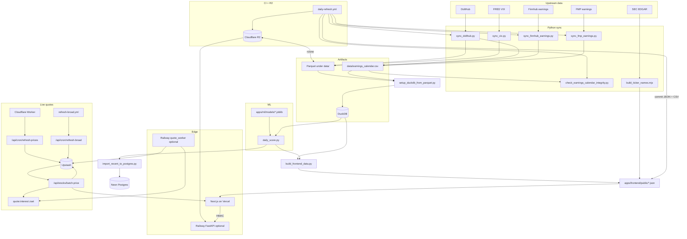

# Quantiv 📈

> Options-implied expected moves around earnings: a Next.js dashboard over prebuilt JSON, optional FastAPI on Railway, and a Python data + ML pipeline (DuckDB / Parquet / LightGBM).


Quantiv is a monorepo for **researching and displaying** expected moves into earnings: weekly calendar, per-symbol detail (straddle vs IV-based move, expiries when data exists), optional **watchlist** with **Clerk** auth, and **Finnhub + Upstash** live quotes. Earnings data blends a **DoltHub** historical baseline with **Finnhub** and **FMP** near-term overlays in git-tracked `data/earnings_calendar.csv`, gated nightly by `scripts/check_earnings_calendar_integrity.py`. The UI ships on **Vercel** using static JSON from `tools/build_frontend_data.py` — no FastAPI call on every navigation. Optional **FastAPI** on **Railway** adds live ML re-inference (`POST /api/ml/predict`) over **Postgres + DuckDB hybrid** with **Redis** and optional **Polygon**.

> Research and educational use only — not financial advice.

## What the app does

| Page | Route | Notes |
|------|-------|-------|
| **Earnings calendar** | `/` | Last / this / next / +2 weeks; filters (popular, S&P 500, movers); live quote overlay |
| **Screener** | `/screener` | Virtualized table from `screener.json` + week files |
| **Symbol detail** | `/[symbol]` | Next earnings, timing, quotes, headline EM; straddle vs IV; per-expiry; live ML predict |
| **Watchlist** | `/watchlist` | Clerk auth; drag-reorder; live prices; batch ML |
| **About** | `/about` | Product and math explainer |
| **ML status** | `/ml-status` | Hidden admin page (Clerk + email allowlist) |

**Vercel API routes**

| Route | Purpose |
|-------|---------|
| `/api/stocks/batch-price` | Read `quote:{symbol}` from Upstash; records user interest for quote prioritization |
| `/api/stocks/intraday` | Alpaca IEX intraday bars (symbol-page sparkline) |
| `/api/stocks/search` | S&P 500 + ETF ticker search |
| `/api/watchlist/*` | CRUD + reorder (Clerk + Neon) |
| `/api/ml/predict`, `/api/ml/batch-predict` | HMAC proxy to Railway; nightly JSON fallback on failure |
| `/api/ml/status` | Admin ML ops diagnostics |
| `/api/cron/refresh-prices` | Bearer `CRON_SECRET` — Finnhub/Alpaca quote writer (Vercel fallback) |
| `/api/cron/refresh-broad` | Bearer `BROAD_REFRESH_SECRET` — Polygon grouped-daily off-hours refresh |

**Railway API (optional)** — see [`apps/backend/routers/ml_predict.py`](apps/backend/routers/ml_predict.py). Legacy GET routes in [`apps/backend/routers/em.py`](apps/backend/routers/em.py) (`/em/*`, `/api/expected-move`) remain for direct HTTP use but are not called by the current frontend.

## What's required vs optional

| Component | Required for | Optional for |
|-----------|--------------|--------------|
| Static JSON in `apps/frontend/public/` | Browsing calendar, screener, symbol pages | — |
| Vercel + Upstash | Live quote display | Offline-only local dev |
| Clerk + Neon | Watchlist | Public browsing |
| Finnhub + cron | Fresh intraday quotes | Stale/missing prices |
| Railway FastAPI + HMAC proxy | Live ML re-inference on symbol/watchlist pages | Nightly ML fields in static JSON still render |
| Railway quote worker | Primary regular-hours quote writer at scale | Vercel cron fallback handles smaller loads |
| Polygon + `refresh-broad` | Off-hours whole-universe quote cache | Extended-hours Alpaca path for today's reporters |
| R2 + GitHub Actions | Nightly data refresh in production | Local `data/` directory |

## Hosting

| Platform | Role | Config |
|----------|------|--------|
| **Vercel** | Next.js UI + API routes + static JSON in `apps/frontend/public` | [`vercel.json`](vercel.json) |
| **Neon** | Postgres — watchlist, `em_forecasts`, cron metadata | `DATABASE_URL` on Vercel (+ Railway if hybrid) |
| **Upstash** | Quote cache (`quote:{symbol}`) via REST on Vercel, TCP on Railway | `UPSTASH_*` / `REDIS_URL` |
| **Cloudflare Worker** | 1-min cron → Vercel `refresh-prices` | [`workers/refresh-prices/`](workers/refresh-prices/README.md) |
| **Railway** (optional) | FastAPI Docker image + `/data` volume | [`railway.toml`](railway.toml), [`docs/RAILWAY_SETUP.md`](docs/RAILWAY_SETUP.md) |
| **Railway quote worker** (optional) | Finnhub WebSocket + REST quote writer | [`railway.worker.toml`](railway.worker.toml) |
| **Cloudflare R2** | Parquet + models blob store (not in git) | [`scripts/r2_*.sh`](scripts/r2_setup.md) |
| **GitHub Actions** | Nightly data refresh, broad quote refresh, PR CI | [`.github/workflows/`](.github/workflows/) |

**DNS:** `usequantiv.com` → Vercel. `api.usequantiv.com` → Railway CNAME. See Railway setup doc for Vercel DNS records.

**ML proxy:** Vercel signs requests to Railway with `BACKEND_URL` + `BACKEND_SHARED_SECRET`. See [docs/HMAC_PROXY.md](docs/HMAC_PROXY.md). Dashboard browsing uses static JSON regardless; live predict uses the proxy when configured.

## Architecture


```mermaid
flowchart TB
  subgraph sources["Upstream data"]
    DH["DoltHub"]
    FH_E["Finnhub earnings"]
    FMP["FMP earnings"]
    FRED["FRED VIX"]
    SEC["SEC EDGAR"]
  end

  subgraph sync["Python sync"]
    SD[sync_dolthub.py]
    SFE[sync_finnhub_earnings.py]
    SFMP[sync_fmp_earnings.py]
    SV[sync_vix.py]
    GATE[check_earnings_calendar_integrity.py]
    BTN[build_ticker_names.mjs]
  end

  DH --> SD
  FH_E --> SFE
  FMP --> SFMP
  FRED --> SV
  SEC --> BTN

  subgraph artifacts["Artifacts"]
    EC["data/earnings_calendar.csv"]
    PQ["Parquet under data/"]
    DUCK[(DuckDB)]
  end

  SD --> EC
  SFE --> EC
  SFMP --> EC
  EC --> GATE
  SD --> PQ
  SV --> PQ

  subgraph ci["CI + R2"]
    R2[(Cloudflare R2)]
    GHA[daily-refresh.yml]
  end

  R2 <-->|rclone| PQ
  GHA --> SD
  GHA --> SFE
  GHA --> SFMP
  GHA --> GATE
  GHA --> R2

  PQ --> VIEWS[setup_duckdb_from_parquet.py]
  EC --> VIEWS
  VIEWS --> DUCK

  subgraph ml["ML"]
    LGBM["apps/ml/models/*.joblib"]
    SCORE[daily_score.py]
  end

  LGBM --> SCORE
  DUCK --> SCORE
  SCORE --> PGIMP[import_recent_to_postgres.py]
  PGIMP --> Neon[(Neon Postgres)]

  DUCK --> BUILD[build_frontend_data.py]
  SCORE --> BUILD
  BUILD --> PUB["apps/frontend/public/*.json"]
  BTN --> PUB

  subgraph deploy["Edge"]
    VERCEL[Next.js on Vercel]
    RAIL[Railway FastAPI optional]
    QW[Railway quote_worker optional]
  end

  PUB --> VERCEL
  GHA -->|commit JSON + CSV| PUB
  R2 --> RAIL

  subgraph quotes["Live quotes"]
    CF[Cloudflare Worker]
    CRON["/api/cron/refresh-prices"]
    BROAD["/api/cron/refresh-broad"]
    GHA_B[refresh-broad.yml]
    UPR[(Upstash)]
    BATCH["/api/stocks/batch-price"]
    INTEREST["quote:interest zset"]
  end

  CF --> CRON
  GHA_B --> BROAD
  CRON --> UPR
  QW --> UPR
  BROAD --> UPR
  BATCH --> UPR
  BATCH --> INTEREST
  QW --> INTEREST
  UPR --> BATCH
  BATCH --> VERCEL
  VERCEL -->|HMAC| RAIL
```

### Live quote pipeline

Three writers share the same `quote:{symbol}` Redis keys:

1. **Railway `quote_worker.py`** (primary at scale) — Finnhub WebSocket for top interest-ranked symbols, REST for the long tail. Reads `quote:interest` (written by `batch-price`) and watchlist/earnings universes. Single-writer lease coordinates with Vercel.
2. **Vercel `refresh-prices`** (fallback) — Finnhub rotating cursor during regular hours; Alpaca IEX for today's BMO/AMC reporters in premarket/afterhours. Defers when Railway owns the lease (`QUOTE_REFRESH_PROVIDER=railway`).
3. **Vercel `refresh-broad`** (off-hours) — One Polygon grouped-daily call for the whole calendar universe. Self-gates during market hours so it never clobbers live ticks. Triggered by [`refresh-broad.yml`](.github/workflows/refresh-broad.yml).

Client reads always go through `/api/stocks/batch-price`, which applies a 5s in-memory cache (`lib/quoteCachePolicy.ts`) and records context-weighted interest (`lib/quoteInterest.ts`) for the worker.

### Nightly pipeline ([`daily-refresh.yml`](.github/workflows/daily-refresh.yml))

Cron `0 11 * * *` (07:00 ET): pull R2 → DoltHub sync → Finnhub + FMP overlays → provider enrichments → **integrity gate** → push Parquet → DuckDB views → freshness check → `daily_score` → `import_recent_to_postgres` → `pull_market_caps` → `build_popular_weights` → `build_frontend_data` → commit `apps/frontend/public/` + `data/earnings_calendar.csv` → Vercel redeploy.

Sunday `0 12 * * 0`: optional LightGBM retrain (`feature_engineering_v3` + `model_trainer_v3`) → push models to R2 → Railway model hot-sync.

Saturday: Finnhub profile/logo sweep (separate job in the same workflow).

### Quarterly ([`refresh-ticker-names.yml`](.github/workflows/refresh-ticker-names.yml))

SEC EDGAR → `ticker-names.json` + `ticker-exchanges.json`.

## Tech stack

| Area | Notes |
|------|--------|
| **Frontend** | Next.js 15 App Router, React 18, TypeScript, Tailwind, TanStack Query (watchlist), Clerk, react-virtuoso (screener) |
| **Backend** | FastAPI, asyncpg, DuckDB, Redis, structlog — [`apps/backend/Dockerfile`](apps/backend/Dockerfile) |
| **Data / ML** | Python 3.11, Parquet, DuckDB, LightGBM v3 in [`apps/ml/`](apps/ml/) |
| **Infra** | Docker Compose (local), Vercel, Railway, R2, GitHub Actions, Cloudflare Worker |

## Project structure

```text
quantiv/
├── apps/
│   ├── frontend/          # Next.js UI, API routes, public JSON, lib/ (quotes, proxy, watchlist)
│   ├── backend/           # FastAPI, routers/, backends/, workers/quote_worker.py
│   └── ml/                # feature_engineering_v3, model_trainer_v3, models/*.joblib
├── config/                # .env.local / .env.production (gitignored)
├── data/                  # Parquet, DuckDB; earnings_calendar.csv tracked
├── docs/                  # Architecture, Railway, performance, HMAC proxy
├── infrastructure/        # docker-compose (local dev), legacy Postgres DDL
├── lib/                   # Shared SP500 JSON + search index (frontend + backend Docker)
├── scripts/               # Sync, scoring, R2, integrity gate, research/archive/
├── tools/                 # build_frontend_data, popular weights, market caps
├── workers/refresh-prices/ # Cloudflare Worker → Vercel quote cron
├── railway.toml           # Railway FastAPI deploy
├── railway.worker.toml    # Railway quote worker deploy (same Docker image)
├── vercel.json
└── package.json           # npm workspaces (apps/frontend)
```

**Not in the production path:** `scripts/archive/`, `scripts/research/`, `apps/ml/archive/`, `infrastructure/database/create-postgres-schema.sql` (legacy options-in-Postgres era), and experimental scripts (`walk_forward.py`, `experiment_*`). See [`scripts/README.md`](scripts/README.md) for the full inventory.

## Prerequisites

- Node 20+, npm
- Python 3.11
- Docker (optional, local stack)
- Local `data/` or R2 pull to build dashboard JSON
- Optional: Finnhub, Upstash, `CRON_SECRET`, Neon `DATABASE_URL`, Clerk keys — see [`.env.example`](.env.example)

## Environment

Next.js and FastAPI load **`config/.env.local`** in dev ([`apps/frontend/next.config.js`](apps/frontend/next.config.js), [`apps/backend/main.py`](apps/backend/main.py)). Production vars go in **Vercel**, **Railway**, and **Wrangler** dashboards.

```bash
cp .env.example config/.env.local
```

Host-specific tables: [`.env.example`](.env.example). Railway walkthrough: [`docs/RAILWAY_SETUP.md`](docs/RAILWAY_SETUP.md).

## Quick start (dashboard)

```bash
npm install
python -m venv .venv && source .venv/bin/activate
pip install -r requirements.txt
# After data/ + DuckDB exist:
npm run data:frontend
npm run dev                    # http://localhost:3000
```

Artifacts: `apps/frontend/public/{weeks/*,screener.json,symbols/*}`. Missing files → follow **Data workflow** below.

## Data workflow

1. **DoltHub** — `npm run data:sync` (+ `--earnings`, `--ohlcv`, `--volhist`; full: `data:sync-full`)
2. **Finnhub overlay** — `npm run data:earnings:finnhub`
3. **FMP overlay** — `npm run data:earnings:fmp` (optional EPS/revenue enrichment)
4. **Integrity** — `python scripts/check_earnings_calendar_integrity.py` (CI blocks commit on failure)
5. **DuckDB views** — `npm run data:views`
6. **Score** — `npm run ml:score`
7. **Frontend JSON** — `npm run data:frontend`

Details: [`scripts/README.md`](scripts/README.md), [`tools/README.md`](tools/README.md).

## Backend (local or Railway)

```bash
npm run dev:backend            # http://localhost:8000/docs
```

`DATA_BACKEND`: `duckdb` | `postgres` | `hybrid`. Local: `./data` paths. Railway: `/data` volume — [`docs/RAILWAY_SETUP.md`](docs/RAILWAY_SETUP.md).

```bash
npm run docker:up              # infrastructure/docker/docker-compose.yml
```

## ML

```bash
npm run ml:features
npm run ml:train
npm run ml:walk-forward        # research only
npm run ml:score
npm run ml:validate
```

Artifacts: `apps/ml/models/`, synced to R2 `data/models/` in CI.

**Two ML paths in the backend:** Path B (`predict_service` + Postgres `feature_vector`) powers the live frontend via `POST /api/ml/predict`. Legacy `MLService` + DuckDB serves the older GET routes in `em.py` and is not used by the current UI.

## npm scripts

| Group | Commands |
|-------|----------|
| Frontend | `dev`, `build`, `lint`, `type-check`, `test`, `test:e2e` |
| Backend | `dev:backend` |
| Docker | `docker:up`, `docker:down` |
| Data | `data:sync`, `data:sync-full`, `data:earnings`, `data:earnings:finnhub`, `data:earnings:fmp`, `data:earnings:fmp-backfill`, `data:earnings:overrides`, `data:fiscal:derive`, `data:profiles:finnhub`, `data:holidays:finnhub`, `data:ohlcv`, `data:csv-parquet`, `data:views`, `data:frontend` |
| ML | `ml:features`, `ml:train`, `ml:walk-forward`, `ml:score`, `ml:validate` |
| Probes (manual) | `data:probe:alphavantage-voi`, `data:probe:providers`, `data:providers:enrich` |

## Performance

First loads on **screener** and **calendar** can feel slow because the UI waits for logo preloads, live batch quotes (up to ~3.2s), and a minimum skeleton delay — not because `screener.json` is huge (~132 KB). Symbol pages ship a large client bundle and re-fetch ticker metadata on the client.

Full audit and fix priority: [**docs/PERFORMANCE.md**](docs/PERFORMANCE.md).

## CI

| Workflow | Trigger |
|----------|---------|
| [`ci.yml`](.github/workflows/ci.yml) | PR / push to `main` — lint, build, pytest, Playwright (needs Clerk E2E secrets for auth specs) |
| [`daily-refresh.yml`](.github/workflows/daily-refresh.yml) | Nightly data pipeline + weekly retrain + Saturday profile sweep |
| [`refresh-broad.yml`](.github/workflows/refresh-broad.yml) | Weekday off-hours Polygon quote warm-up → Vercel `refresh-broad` |
| [`refresh-ticker-names.yml`](.github/workflows/refresh-ticker-names.yml) | Quarterly SEC EDGAR ticker names |

## Accuracy & data sources

- Headline EM in the UI is mainly straddle / IV-baseline unless ML fields are in the static JSON or live predict succeeds.
- Browsing uses generated JSON, not Railway, for calendar/screener/symbol baseline data.
- Quotes: Finnhub (+ Railway WebSocket when deployed) + Upstash on Vercel; Alpaca for extended hours; Polygon for off-hours broad refresh.
- **Popular** filter uses weights from `tools/build_popular_weights.py` (threshold in `apps/frontend/lib/popular.ts`).
- `/public/weekly.json` is a legacy fallback; primary week data lives under `/weeks/`.

## Documentation

| Doc | Topic |
|-----|--------|
| [docs/README.md](docs/README.md) | Full index |
| [docs/RAILWAY_SETUP.md](docs/RAILWAY_SETUP.md) | FastAPI + quote worker on Railway |
| [docs/HMAC_PROXY.md](docs/HMAC_PROXY.md) | Vercel ↔ Railway signed proxy |
| [docs/duckdb_architecture.md](docs/duckdb_architecture.md) | DuckDB / hybrid backend (some paths dated) |
| [docs/PERFORMANCE.md](docs/PERFORMANCE.md) | Frontend load times |
| [scripts/README.md](scripts/README.md) | Provider/data pipeline runbook |
| [workers/refresh-prices/README.md](workers/refresh-prices/README.md) | Cloudflare Worker cron setup |

## License

GPL-3.0 — see [LICENSE](LICENSE).
