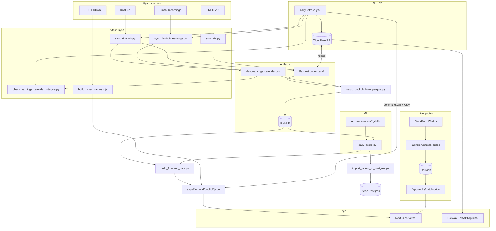

# Quantiv 📈

> Options-implied expected moves around earnings: a Next.js dashboard over prebuilt JSON, optional FastAPI on Railway, and a Python data + ML pipeline (DuckDB / Parquet / LightGBM).


Quantiv is a monorepo for **researching and displaying** expected moves into earnings: weekly calendar, per-symbol detail (straddle vs IV-based move, expiries when data exists), optional **watchlist** with **Clerk** auth, and **Finnhub + Upstash** live quotes. Earnings data blends a **DoltHub** historical baseline with a **Finnhub** near-term overlay in git-tracked `data/earnings_calendar.csv`, gated nightly by `scripts/check_earnings_calendar_integrity.py`. The UI ships on **Vercel** using static JSON from `tools/build_frontend_data.py` — no FastAPI call on every navigation. Optional **FastAPI** on **Railway** adds expected-move / ML HTTP APIs over **Postgres, DuckDB, or hybrid** with **Redis** and optional **Polygon**.

> Research and educational use only — not financial advice.

## What the app does

- **Dashboard** — Last / this / next / +2 weeks; filters (popular, S&P 500, movers); links to symbol pages.
- **Symbol pages** — Next earnings, timing, quotes, headline EM; straddle vs IV; per-expiry when data exists.
- **Screener** — Virtualized table with live quote overlay when Upstash is configured.
- **APIs (Vercel)** — Search, batch quotes, watchlist (Clerk + Neon), `/api/cron/refresh-prices` (Bearer `CRON_SECRET`).
- **APIs (Railway, optional)** — `/health`, `/api/expected-move`, `/em/*`, `/api/ml/*` — see `apps/backend/routers/em.py`.

## Hosting

| Platform | Role | Config |
|----------|------|--------|
| **Vercel** | Next.js UI + API routes + static JSON in `apps/frontend/public` | [`vercel.json`](vercel.json) |
| **Neon** | Postgres — watchlist, cron cursor, optional `em_forecasts` rows | `DATABASE_URL` on Vercel (+ Railway if hybrid) |
| **Upstash** | Quote cache (`quote:{symbol}`) via REST on Vercel, TCP on Railway | `UPSTASH_*` / `REDIS_URL` |
| **Cloudflare Worker** | Market-hours cron → Vercel refresh-prices | [`workers/refresh-prices/`](workers/refresh-prices/README.md) |
| **Cloudflare R2** | Parquet + models blob store (not in git) | [`scripts/r2_*.sh`](scripts/r2_setup.md) |
| **GitHub Actions** | Nightly data refresh + PR CI | [`.github/workflows/`](.github/workflows/) |
| **Railway** (optional) | FastAPI Docker image + `/data` volume | [`railway.toml`](railway.toml), [`docs/RAILWAY_SETUP.md`](docs/RAILWAY_SETUP.md) |

**DNS:** `usequantiv.com` → Vercel (nameservers `ns*.vercel-dns.com`). `api.usequantiv.com` → Railway CNAME. See Railway setup doc for Vercel DNS records.

**Note:** Live ML re-inference uses the HMAC proxy (`BACKEND_URL` + `BACKEND_SHARED_SECRET` on Vercel → Railway). See [docs/HMAC_PROXY.md](docs/HMAC_PROXY.md). Dashboard browsing still uses static JSON when the proxy is not configured.

## Architecture


```mermaid
flowchart TB
  subgraph sources["Upstream data"]
    DH["DoltHub"]
    FH_E["Finnhub earnings"]
    FRED["FRED VIX"]
    SEC["SEC EDGAR"]
  end

  subgraph sync["Python sync"]
    SD[sync_dolthub.py]
    SFE[sync_finnhub_earnings.py]
    SV[sync_vix.py]
    GATE[check_earnings_calendar_integrity.py]
    BTN[build_ticker_names.mjs]
  end

  DH --> SD
  FH_E --> SFE
  FRED --> SV
  SEC --> BTN

  subgraph artifacts["Artifacts"]
    EC["data/earnings_calendar.csv"]
    PQ["Parquet under data/"]
    DUCK[(DuckDB)]
  end

  SD --> EC
  SFE --> EC
  EC --> GATE
  SD --> PQ
  SV --> PQ

  subgraph ci["CI + R2"]
    R2[(Cloudflare R2)]
    GHA[daily-refresh.yml]
  end

  R2 <-->|rclone| PQ
  GHA --> SD
  GHA --> SFE
  GHA --> GATE
  GHA --> R2

  PQ --> VIEWS[setup_duckdb_from_parquet.py]
  EC --> VIEWS
  VIEWS --> DUCK

  subgraph ml["ML"]
    LGBM["apps/ml/models/*.joblib"]
    SCORE[daily_score.py]
  end

  LGBM --> SCORE
  DUCK --> SCORE
  SCORE --> PGIMP[import_recent_to_postgres.py]
  PGIMP --> Neon[(Neon Postgres)]

  DUCK --> BUILD[build_frontend_data.py]
  SCORE --> BUILD
  BUILD --> PUB["apps/frontend/public/*.json"]
  BTN --> PUB

  subgraph deploy["Edge"]
    VERCEL[Next.js on Vercel]
    RAIL[Railway FastAPI optional]
  end

  PUB --> VERCEL
  GHA -->|commit JSON + CSV| PUB
  R2 --> RAIL

  subgraph quotes["Live quotes"]
    CF[Cloudflare Worker]
    CRON["/api/cron/refresh-prices"]
    UPR[(Upstash)]
    BATCH["/api/stocks/batch-price"]
  end

  CF --> CRON
  CRON --> UPR
  UPR --> BATCH
  BATCH --> VERCEL
```

### Nightly pipeline ([`daily-refresh.yml`](.github/workflows/daily-refresh.yml))

Cron `0 11 * * *` (07:00 ET): pull R2 → DoltHub sync → Finnhub overlay → **integrity gate** → push Parquet → DuckDB views → freshness check → `daily_score` → `import_recent_to_postgres` → `pull_market_caps` → `build_popular_weights` → `build_frontend_data` → commit `apps/frontend/public/` + `data/earnings_calendar.csv` → Vercel redeploy.

Sunday `0 12 * * 0`: optional LightGBM retrain (`feature_engineering_v3` + `model_trainer_v3`) → push models to R2.

### Quarterly ([`refresh-ticker-names.yml`](.github/workflows/refresh-ticker-names.yml))

SEC EDGAR → `ticker-names.json` + `ticker-exchanges.json`.

## Tech stack

| Area | Notes |
|------|--------|
| **Frontend** | Next.js 15 App Router, React 18, TypeScript, Tailwind, TanStack Query (watchlist), Clerk |
| **Backend** | FastAPI, asyncpg, DuckDB, Redis, structlog — [`apps/backend/Dockerfile`](apps/backend/Dockerfile) |
| **Data / ML** | Python 3.11, Parquet, DuckDB, LightGBM in [`apps/ml/`](apps/ml/) |
| **Infra** | Docker Compose (local), Vercel, Railway, R2, GitHub Actions, Cloudflare Worker |

## Project structure

```text
quantiv/
├── apps/
│   ├── frontend/          # Next.js UI, API routes, public JSON
│   ├── backend/           # FastAPI, routers, backends/, models/ (Pydantic)
│   └── ml/                # Features, training, models/*.joblib
├── config/                # .env.local / .env.production (gitignored)
├── data/                  # Parquet, DuckDB; earnings_calendar.csv tracked
├── docs/                  # Architecture, Railway, performance, plans
├── infrastructure/        # docker-compose, database helpers
├── lib/                   # Shared TS + sp500-constituents.json
├── scripts/               # Sync, scoring, R2, integrity gate
├── tools/                 # build_frontend_data, popular weights, market caps
├── workers/refresh-prices/  # Cron → Vercel quote refresh
├── railway.toml           # Railway Docker deploy (no startCommand — use Dockerfile CMD)
├── vercel.json
└── package.json           # npm workspaces (apps/frontend)
```

## Prerequisites

- Node 20+, npm  
- Python 3.11  
- Docker (optional, local stack)  
- Local `data/` or R2 pull to build dashboard JSON  
- Optional: Finnhub, Upstash, `CRON_SECRET`, Neon `DATABASE_URL`, Clerk keys — see [`.env.example`](.env.example)

## Environment

Next.js and FastAPI load **`config/.env.local`** in dev ([`apps/frontend/next.config.js`](apps/frontend/next.config.js), [`apps/backend/main.py`](apps/backend/main.py)). Production vars go in **Vercel**, **Railway**, and **Wrangler** dashboards.

```bash
cp .env.example config/.env.local
```

Host-specific tables: [`.env.example`](.env.example). Railway walkthrough: [`docs/RAILWAY_SETUP.md`](docs/RAILWAY_SETUP.md).

## Quick start (dashboard)

```bash
npm install
python -m venv .venv && source .venv/bin/activate
pip install -r requirements.txt
# After data/ + DuckDB exist:
npm run data:frontend
npm run dev                    # http://localhost:3000
```

Artifacts: `apps/frontend/public/{weekly.json,weeks/*,symbols/*,screener.json}`. Missing files → follow **Data workflow** below.

## Data workflow

1. **DoltHub** — `npm run data:sync` (+ `--earnings`, `--ohlcv`, `--volhist`; full: `data:sync-full`)
2. **Finnhub overlay** — `npm run data:earnings:finnhub`
3. **Integrity** — `python scripts/check_earnings_calendar_integrity.py` (CI blocks commit on failure)
4. **DuckDB views** — `npm run data:views`
5. **Score** — `npm run ml:score`
6. **Frontend JSON** — `npm run data:frontend`

Details: [`scripts/README.md`](scripts/README.md), [`tools/README.md`](tools/README.md).

## Backend (local or Railway)

```bash
npm run dev:backend            # http://localhost:8000/docs
```

`DATA_BACKEND`: `duckdb` | `postgres` | `hybrid`. Local: `./data` paths. Railway: `/data` volume — [`docs/RAILWAY_SETUP.md`](docs/RAILWAY_SETUP.md).

```bash
npm run docker:up              # infrastructure/docker/docker-compose.yml
```

## ML

```bash
npm run ml:features
npm run ml:train
npm run ml:walk-forward
npm run ml:score
npm run ml:validate
```

Artifacts: `apps/ml/models/`, synced to R2 `data/models/` in CI.

## npm scripts

| Group | Commands |
|-------|----------|
| Frontend | `dev`, `build`, `lint`, `type-check`, `test`, `test:e2e` |
| Backend | `dev:backend` |
| Docker | `docker:up`, `docker:down` |
| Data | `data:sync`, `data:sync-full`, `data:earnings`, `data:earnings:finnhub`, `data:ohlcv`, `data:csv-parquet`, `data:views`, `data:frontend` |
| ML | `ml:features`, `ml:train`, `ml:walk-forward`, `ml:score`, `ml:validate` |

## Performance

First loads on **screener** and **calendar** can feel slow because the UI waits for logo preloads, live batch quotes (up to ~3.2s), and a minimum skeleton delay — not because `screener.json` is huge (~132 KB). Symbol pages ship a large client bundle (~3.4k lines) and re-fetch ticker metadata on the client.

Full audit and fix priority: [**docs/PERFORMANCE.md**](docs/PERFORMANCE.md).

## CI

| Workflow | Trigger |
|----------|---------|
| [`ci.yml`](.github/workflows/ci.yml) | PR / push to `main` — lint, build, pytest, Playwright (needs Clerk E2E secrets for auth specs) |
| [`daily-refresh.yml`](.github/workflows/daily-refresh.yml) | Nightly + weekly retrain |
| [`refresh-ticker-names.yml`](.github/workflows/refresh-ticker-names.yml) | Quarterly |

## Accuracy & data sources

- Headline EM in the UI is mainly straddle / IV-baseline unless ML fields are in the static JSON.
- Browsing uses generated JSON, not Railway, unless a future `BACKEND_URL` proxy is added.
- Quotes: Finnhub + Upstash on Vercel; Polygon optional on FastAPI.
- **Popular** filter uses weights from `tools/build_popular_weights.py` (threshold in `apps/frontend/lib/popular.ts`).

## Documentation

| Doc | Topic |
|-----|--------|
| [docs/README.md](docs/README.md) | Full index |
| [docs/RAILWAY_SETUP.md](docs/RAILWAY_SETUP.md) | FastAPI on Railway |
| [docs/duckdb_architecture.md](docs/duckdb_architecture.md) | DuckDB / hybrid backend |
| [docs/PERFORMANCE.md](docs/PERFORMANCE.md) | Frontend load times |
| [scripts/README.md](scripts/README.md) | Provider/data pipeline runbook |

## License

GPL-3.0 — see [LICENSE](LICENSE).
