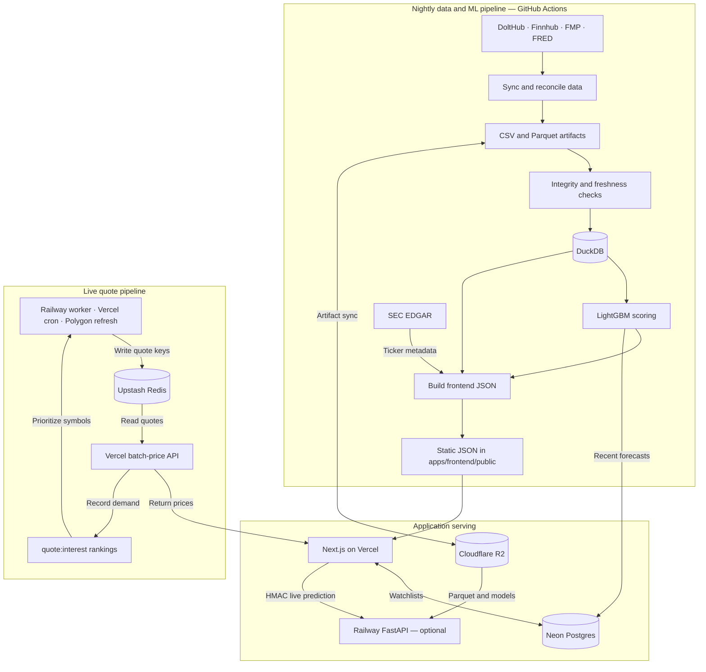

# Quantiv 📈

> An earnings analytics platform for researching options-implied expected moves, comparing volatility signals, and generating machine-learning forecasts.


Quantiv is a monorepo for analyzing expected stock-price moves around earnings announcements. It combines historical earnings data, options-derived expected moves, volatility features, live market quotes, and LightGBM forecasts in a Next.js dashboard.

The primary dashboard is served from prebuilt static JSON generated by a Python data pipeline. This keeps calendar, screener, and symbol-page navigation independent of the backend. An optional FastAPI deployment on Railway provides live ML re-inference, while Upstash Redis supports live quote delivery.

> **Research and educational use only. Quantiv does not provide financial advice.**

## Highlights

| Metric                   | Current scale |
| ------------------------ | ------------: |
| Earnings records         |      120,000+ |
| Ticker identities        |       10,000+ |
| Product surfaces         |             6 |
| Vercel API routes        |            12 |
| Quote-writing paths      |             3 |
| GitHub Actions workflows |             5 |

## Product surfaces

| Surface           | Route        | Description                                                                                                   |
| ----------------- | ------------ | ------------------------------------------------------------------------------------------------------------- |
| Earnings calendar | `/`          | Browse previous and upcoming earnings weeks with popular, S&P 500, and mover filters                          |
| Screener          | `/screener`  | Search and compare earnings opportunities in a virtualized table                                              |
| Symbol detail     | `/[symbol]`  | View earnings timing, headline expected move, volatility estimates, expiries, quotes, and live ML predictions |
| Watchlist         | `/watchlist` | Save, reorder, price, and score tracked symbols using Clerk authentication                                    |
| About             | `/about`     | Review the product methodology and expected-move concepts                                                     |
| ML operations     | `/ml-status` | Protected diagnostics page for model and backend status                                                       |

## Architecture

Quantiv has three primary system paths:

1. A scheduled data and ML pipeline that produces static dashboard artifacts.
2. An optional backend for live ML inference.
3. A live quote pipeline backed by Upstash Redis.


```mermaid
flowchart TB
  subgraph nightly["Nightly data and ML pipeline — GitHub Actions"]
    PROVIDERS["DoltHub · Finnhub · FMP · FRED"]
    SYNC["Sync and reconcile data"]
    FILES["CSV and Parquet artifacts"]
    GATE["Integrity and freshness checks"]
    DUCK[(DuckDB)]
    SCORE["LightGBM scoring"]
    BUILD["Build frontend JSON"]
    PUB["Static JSON in apps/frontend/public"]
    SEC["SEC EDGAR"]

    PROVIDERS --> SYNC --> FILES --> GATE --> DUCK
    DUCK --> SCORE --> BUILD --> PUB
    DUCK --> BUILD
    SEC -->|Ticker metadata| BUILD
  end

  R2[(Cloudflare R2)]
  FILES <-->|Artifact sync| R2

  subgraph application["Application serving"]
    VERCEL["Next.js on Vercel"]
    RAILWAY["Railway FastAPI — optional"]
    NEON[(Neon Postgres)]

    PUB --> VERCEL
    VERCEL <-->|Watchlists| NEON
    VERCEL -->|HMAC live prediction| RAILWAY
    R2 -->|Parquet and models| RAILWAY
    SCORE -->|Recent forecasts| NEON
  end

  subgraph quotes["Live quote pipeline"]
    WRITERS["Railway worker · Vercel cron · Polygon refresh"]
    UPSTASH[(Upstash Redis)]
    BATCH["Vercel batch-price API"]
    INTEREST["quote:interest rankings"]

    WRITERS -->|Write quote keys| UPSTASH
    UPSTASH -->|Read quotes| BATCH
    BATCH -->|Return prices| VERCEL
    BATCH -->|Record demand| INTEREST
    INTEREST -->|Prioritize symbols| WRITERS
  end
```

### Static dashboard path

The calendar, screener, and baseline symbol data are generated by:

```text
Provider data
→ CSV and Parquet artifacts
→ DuckDB views
→ ML scoring
→ frontend JSON
→ Next.js on Vercel
```

Generated files are placed under:

```text
apps/frontend/public/
├── weeks/
├── symbols/
├── screener.json
├── ticker-names.json
└── ticker-exchanges.json
```

The frontend reads these files directly. It does not call FastAPI on every page navigation.

### Live ML path

The optional Railway backend supports live re-inference through:

```text
Vercel
→ signed HMAC proxy
→ Railway FastAPI
→ Postgres and DuckDB-backed features
→ prediction response
```

If the backend is unavailable, symbol and watchlist pages can continue displaying ML fields included in the nightly static JSON.

### Live quote path

All quote writers share the same Upstash keys:

```text
quote:{symbol}
```

The quote system has three writer paths:

1. **Railway quote worker**
   The primary scaled writer. It uses Finnhub WebSocket data for high-priority symbols and REST requests for the long tail.

2. **Vercel `refresh-prices` cron**
   A regular-hours fallback that rotates through symbols with Finnhub and uses Alpaca IEX for selected extended-hours reporters.

3. **Vercel `refresh-broad` cron**
   An off-hours broad refresh using Polygon grouped-daily data.

Client quote reads go through:

```text
/api/stocks/batch-price
```

The route reads cached quotes, applies a short in-memory cache, and records context-weighted demand in the `quote:interest` sorted set. The Railway worker consumes those rankings to prioritize active symbols.

## Deployment and services

| Service              | Role                                                       | Required?                                    |
| -------------------- | ---------------------------------------------------------- | -------------------------------------------- |
| Vercel               | Hosts the Next.js application, API routes, and static JSON | Yes for production web deployment            |
| Static frontend JSON | Powers calendar, screener, and baseline symbol pages       | Yes                                          |
| Upstash Redis        | Stores live quote keys and quote-interest rankings         | Required for live quote display              |
| Finnhub              | Earnings overlay and regular-hours quote source            | Required for the primary live quote workflow |
| Clerk                | Authentication for watchlists and protected admin surfaces | Optional                                     |
| Neon                 | Stores watchlists, forecasts, and cron metadata            | Optional for public browsing                 |
| Railway FastAPI      | Provides live ML inference and legacy backend routes       | Optional                                     |
| Railway quote worker | Provides scaled WebSocket and REST quote ingestion         | Optional                                     |
| Polygon              | Provides off-hours whole-universe quote refreshes          | Optional                                     |
| Alpaca IEX           | Provides selected intraday and extended-hours data         | Optional                                     |
| Cloudflare Worker    | Triggers the high-frequency Vercel quote refresh route     | Optional                                     |
| Cloudflare R2        | Stores Parquet datasets and model artifacts outside Git    | Required for the hosted data pipeline        |
| GitHub Actions       | Runs validation, refresh, enrichment, and model workflows  | Required for automated production refreshes  |

Production DNS:

```text
usequantiv.com      → Vercel
api.usequantiv.com  → Railway
```

See [`docs/RAILWAY_SETUP.md`](docs/RAILWAY_SETUP.md) for deployment configuration.

## Data sources

| Source                  | Usage                                                                 |
| ----------------------- | --------------------------------------------------------------------- |
| DoltHub                 | Historical earnings-calendar baseline                                 |
| Finnhub                 | Near-term earnings overlays, company profiles, logos, and live quotes |
| Financial Modeling Prep | Earnings, EPS, and revenue enrichment                                 |
| FRED                    | VIX and macro-volatility inputs                                       |
| SEC EDGAR               | Ticker names, exchanges, and public-company identity metadata         |
| Alpaca IEX              | Intraday bars and selected extended-hours pricing                     |
| Polygon                 | Off-hours broad quote-cache refresh                                   |

Earnings-provider outputs are reconciled into:

```text
data/earnings_calendar.csv
```

The integrity gate validates this file before downstream data generation proceeds.

## Technology stack

| Area                 | Technologies                                                       |
| -------------------- | ------------------------------------------------------------------ |
| Frontend             | Next.js 15, React 18, TypeScript, Tailwind CSS                     |
| Frontend data        | Static JSON, TanStack Query, react-virtuoso                        |
| Authentication       | Clerk                                                              |
| Backend              | FastAPI, asyncpg, structlog                                        |
| Analytics storage    | DuckDB, Parquet                                                    |
| Application database | Neon Postgres                                                      |
| Cache                | Upstash Redis                                                      |
| ML                   | Python 3.11, LightGBM                                              |
| Infrastructure       | Vercel, Railway, Cloudflare R2, Cloudflare Workers, GitHub Actions |
| Local development    | npm workspaces, Python virtual environments, Docker Compose        |

## Repository structure

```text
quantiv/
├── apps/
│   ├── frontend/              # Next.js UI, API routes, public JSON, and frontend libraries
│   ├── backend/               # FastAPI application, routers, services, and quote worker
│   └── ml/                    # Feature engineering, training, validation, and model artifacts
├── config/                    # Local environment files; gitignored
├── data/                      # CSV, Parquet, and DuckDB data
├── docs/                      # Architecture, deployment, proxy, and performance documentation
├── infrastructure/            # Docker Compose and legacy database infrastructure
├── lib/                       # Shared ticker and S&P 500 metadata
├── scripts/                   # Data synchronization, scoring, validation, and R2 utilities
├── tools/                     # Frontend-data, market-cap, and popularity builders
├── workers/
│   └── refresh-prices/        # Cloudflare Worker for Vercel quote cron
├── railway.toml               # Railway FastAPI deployment
├── railway.worker.toml        # Railway quote-worker deployment
├── vercel.json                # Vercel configuration
└── package.json               # Root npm workspace and task definitions
```

The following directories and scripts are not part of the main production path:

```text
scripts/archive/
scripts/research/
apps/ml/archive/
infrastructure/database/create-postgres-schema.sql
walk_forward.py
experiment_*
```

See [`scripts/README.md`](scripts/README.md) for the complete script inventory.

## Prerequisites

Install:

* Node.js 20 or newer
* npm
* Python 3.11
* Docker, when using the local container stack
* Local data artifacts or access to the R2 bucket

Optional integrations require credentials for services such as Finnhub, Upstash, Clerk, Neon, Railway, Polygon, and Alpaca.

## Environment configuration

Copy the environment template:

```bash
cp .env.example config/.env.local
```

During local development:

* Next.js loads `config/.env.local` through `apps/frontend/next.config.js`.
* FastAPI loads `config/.env.local` through `apps/backend/main.py`.

Production variables are configured separately in:

* Vercel
* Railway
* Cloudflare Wrangler
* GitHub Actions secrets

See [`.env.example`](.env.example) for the complete variable inventory.

## Local development

### Install dependencies

```bash
npm install

python -m venv .venv
source .venv/bin/activate

pip install -r requirements.txt
```

On Windows PowerShell, activate the environment with:

```powershell
.venv\Scripts\Activate.ps1
```

### Start the dashboard

The dashboard requires generated files in `apps/frontend/public/`.

After the local datasets and DuckDB views are available:

```bash
npm run data:frontend
npm run dev
```

Open:

```text
http://localhost:3000
```

### Start the backend

```bash
npm run dev:backend
```

Open the API documentation at:

```text
http://localhost:8000/docs
```

The backend supports:

```text
DATA_BACKEND=duckdb
DATA_BACKEND=postgres
DATA_BACKEND=hybrid
```

Local deployments normally read files under `./data`. Railway deployments use the mounted `/data` volume.

### Start the local container stack

```bash
npm run docker:up
```

Stop it with:

```bash
npm run docker:down
```

The Docker Compose configuration is located at:

```text
infrastructure/docker/docker-compose.yml
```

## Data workflow

Run the data pipeline manually in the following order.

### 1. Synchronize the historical baseline

```bash
npm run data:sync
```

For the expanded synchronization workflow:

```bash
npm run data:sync-full
```

### 2. Apply near-term earnings overlays

```bash
npm run data:earnings:finnhub
npm run data:earnings:fmp
```

The FMP step is optional when its EPS and revenue enrichment is not required.

### 3. Validate the earnings calendar

```bash
python scripts/check_earnings_calendar_integrity.py
```

This gate should pass before generated data is committed or deployed.

### 4. Build DuckDB views

```bash
npm run data:views
```

### 5. Score the latest observations

```bash
npm run ml:score
```

### 6. Generate frontend JSON

```bash
npm run data:frontend
```

The resulting dashboard artifacts are written to:

```text
apps/frontend/public/
```

Additional provider and data commands are documented in:

* [`scripts/README.md`](scripts/README.md)
* [`tools/README.md`](tools/README.md)

## Machine learning

The active ML implementation is located under:

```text
apps/ml/
```

Common commands:

```bash
npm run ml:features
npm run ml:train
npm run ml:score
npm run ml:validate
```

The walk-forward workflow is intended for research rather than the main production pipeline:

```bash
npm run ml:walk-forward
```

Model artifacts are stored under:

```text
apps/ml/models/
```

Production workflows synchronize models to:

```text
R2 data/models/
```

### Backend prediction paths

The backend currently contains two prediction paths.

**Current live frontend path**

```text
POST /api/ml/predict
→ predict_service
→ Postgres feature_vector
```

This path powers live symbol-page and watchlist inference.

**Legacy direct HTTP path**

```text
GET /em/*
GET /api/expected-move
→ MLService
→ DuckDB
```

These routes remain available for direct backend use but are not called by the current frontend.

## Frontend API routes

| Route                      | Purpose                                                          |
| -------------------------- | ---------------------------------------------------------------- |
| `/api/stocks/batch-price`  | Reads cached quotes and records quote demand                     |
| `/api/stocks/intraday`     | Returns Alpaca IEX intraday bars                                 |
| `/api/stocks/search`       | Searches supported stock and ETF metadata                        |
| `/api/watchlist/*`         | Creates, reads, updates, reorders, and deletes watchlist entries |
| `/api/ml/predict`          | Proxies one live prediction request to Railway                   |
| `/api/ml/batch-predict`    | Proxies multiple live prediction requests                        |
| `/api/ml/status`           | Returns protected ML operations diagnostics                      |
| `/api/cron/refresh-prices` | Refreshes regular-hours and selected extended-hours quotes       |
| `/api/cron/refresh-broad`  | Refreshes the broad quote universe outside market hours          |

The ML proxy signs Railway requests using:

```text
BACKEND_URL
BACKEND_SHARED_SECRET
```

See [`docs/HMAC_PROXY.md`](docs/HMAC_PROXY.md) for the signing design.

Protected cron routes use dedicated bearer secrets, including:

```text
CRON_SECRET
BROAD_REFRESH_SECRET
```

## Production automation

### Nightly data refresh

Workflow:

```text
.github/workflows/daily-refresh.yml
```

Default schedule:

```text
0 11 * * *
```

This corresponds to approximately 07:00 Eastern Time during daylight saving time.

The production sequence is:

```text
Pull artifacts from R2
→ synchronize DoltHub history
→ apply Finnhub and FMP overlays
→ run provider enrichments
→ validate the earnings calendar
→ push Parquet artifacts
→ build DuckDB views
→ check freshness
→ score recent observations
→ import forecasts to Postgres
→ update market-cap and popularity metadata
→ generate frontend JSON
→ commit generated JSON and earnings CSV
→ trigger Vercel deployment
```

### Weekly model training

On Sunday, the nightly workflow can run:

```text
feature_engineering_v3
→ model_trainer_v3
→ push models to R2
→ Railway model synchronization
```

### Company-profile refresh

On Saturday, the workflow performs a Finnhub company-profile and logo sweep.

### Ticker metadata refresh

Workflow:

```text
.github/workflows/refresh-ticker-names.yml
```

This runs quarterly and generates:

```text
ticker-names.json
ticker-exchanges.json
```

from SEC EDGAR metadata.

## Continuous integration

| Workflow                   | Trigger                            | Purpose                                                           |
| -------------------------- | ---------------------------------- | ----------------------------------------------------------------- |
| `ci.yml`                   | Pull requests and pushes to `main` | Linting, build validation, pytest, and Playwright                 |
| `daily-refresh.yml`        | Nightly schedule                   | Data refresh, scoring, frontend generation, and optional training |
| `refresh-broad.yml`        | Weekday off-hours schedule         | Polygon quote-cache warming                                       |
| `refresh-ticker-names.yml` | Quarterly schedule                 | SEC ticker-name and exchange refresh                              |
| Enrichment workflows       | Scheduled or manual                | Provider-specific metadata and data enrichment                    |

Authenticated Playwright specifications require Clerk E2E secrets.

## Performance

Initial calendar and screener loads may be delayed by:

* Logo preloading
* Live batch-quote requests
* Minimum skeleton-display timing

The static screener dataset itself is relatively small, at approximately 132 KB.

Symbol pages also ship a comparatively large client bundle and may re-fetch ticker metadata on the client.

See [`docs/PERFORMANCE.md`](docs/PERFORMANCE.md) for the current audit and prioritized improvements.

## Data behavior and limitations

* The headline expected move is generally based on a straddle or IV-derived baseline unless an ML result is present.
* ML values may come from nightly static JSON or a successful live Railway prediction.
* Calendar, screener, and baseline symbol browsing use generated JSON rather than Railway.
* Live prices are cached and may be stale or unavailable when quote providers or refresh workers are not configured.
* The `Popular` filter uses weights generated by `tools/build_popular_weights.py`.
* The popularity threshold is configured in `apps/frontend/lib/popular.ts`.
* `/public/weekly.json` is a legacy fallback.
* Primary weekly data is stored under `/public/weeks/`.
* Provider datasets can disagree on announcement dates, earnings timing, EPS, or revenue estimates.
* The earnings-calendar integrity gate reduces these inconsistencies but cannot guarantee provider accuracy.

## Documentation

| Document                                                               | Topic                                   |
| ---------------------------------------------------------------------- | --------------------------------------- |
| [`docs/README.md`](docs/README.md)                                     | Documentation index                     |
| [`docs/RAILWAY_SETUP.md`](docs/RAILWAY_SETUP.md)                       | Railway API and quote-worker deployment |
| [`docs/HMAC_PROXY.md`](docs/HMAC_PROXY.md)                             | Signed Vercel-to-Railway requests       |
| [`docs/duckdb_architecture.md`](docs/duckdb_architecture.md)           | DuckDB and hybrid-backend architecture  |
| [`docs/PERFORMANCE.md`](docs/PERFORMANCE.md)                           | Frontend performance audit              |
| [`scripts/README.md`](scripts/README.md)                               | Data-provider and pipeline runbook      |
| [`tools/README.md`](tools/README.md)                                   | Generated frontend-data tooling         |
| [`workers/refresh-prices/README.md`](workers/refresh-prices/README.md) | Cloudflare quote-cron configuration     |

Some paths in `docs/duckdb_architecture.md` may describe earlier implementations. Confirm current behavior against the application code when making architectural changes.

## License

Quantiv is licensed under the GNU General Public License v3.0.

See [LICENSE](LICENSE) for the full license text.
