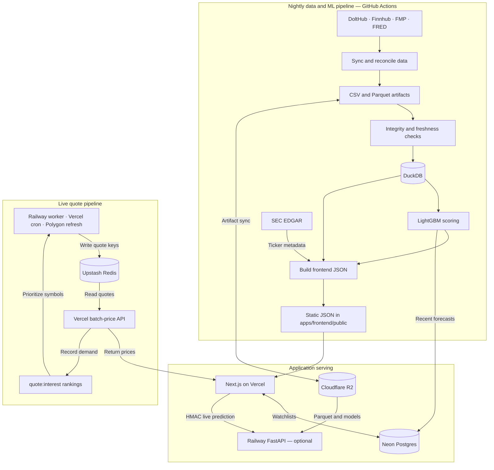

# Quantiv 📈

> Options-implied expected moves around earnings, historical volatility research, and machine-learning forecasts in one dashboard.


Quantiv is a full-stack earnings analytics platform for researching expected stock-price moves around earnings announcements. It combines historical earnings data, options-derived expected moves, volatility features, live market quotes, and LightGBM forecasts in a Next.js dashboard.

The main application is served from prebuilt static JSON generated by a Python data pipeline, so calendar, screener, and symbol-page navigation do not depend on a backend request. Optional Railway services add live ML re-inference and scaled quote ingestion.

> **Research and educational use only. Quantiv does not provide financial advice.**

## At a glance

- 120,000+ historical earnings records
- 10,000+ searchable ticker identities
- Nightly provider reconciliation and ML scoring
- Static-first Next.js frontend with optional live inference
- Live quotes through a shared Upstash Redis cache

## Product

| Surface | Route | Description |
|---|---|---|
| Earnings calendar | `/` | Browse previous and upcoming earnings weeks with popular, S&P 500, and mover filters |
| Screener | `/screener` | Search and compare earnings opportunities in a virtualized table |
| Symbol detail | `/[symbol]` | View earnings timing, expected moves, volatility estimates, expiries, quotes, and ML predictions |
| Watchlist | `/watchlist` | Save, reorder, price, and score tracked symbols with Clerk authentication |
| About | `/about` | Review the methodology and expected-move concepts |
| ML operations | `/ml-status` | Protected diagnostics for model and backend status |

## Architecture

Quantiv has three primary system paths:

1. A scheduled data and ML pipeline that generates static dashboard artifacts.
2. An optional Railway backend for live ML inference.
3. A live quote pipeline backed by Upstash Redis.


```mermaid
flowchart TB
  subgraph nightly["Nightly data and ML pipeline — GitHub Actions"]
    PROVIDERS["DoltHub · Finnhub · FMP · FRED"]
    SYNC["Sync and reconcile data"]
    FILES["CSV and Parquet artifacts"]
    GATE["Integrity and freshness checks"]
    DUCK[(DuckDB)]
    SCORE["LightGBM scoring"]
    BUILD["Build frontend JSON"]
    PUB["Static JSON in apps/frontend/public"]
    SEC["SEC EDGAR"]

    PROVIDERS --> SYNC --> FILES --> GATE --> DUCK
    DUCK --> SCORE --> BUILD --> PUB
    DUCK --> BUILD
    SEC -->|Ticker metadata| BUILD
  end

  R2[(Cloudflare R2)]
  FILES <-->|Artifact sync| R2

  subgraph application["Application serving"]
    VERCEL["Next.js on Vercel"]
    RAILWAY["Railway FastAPI — optional"]
    NEON[(Neon Postgres)]

    PUB --> VERCEL
    VERCEL <-->|Watchlists| NEON
    VERCEL -->|HMAC live prediction| RAILWAY
    R2 -->|Parquet and models| RAILWAY
    SCORE -->|Recent forecasts| NEON
  end

  subgraph quotes["Live quote pipeline"]
    WRITERS["Railway worker · Vercel cron · Polygon refresh"]
    UPSTASH[(Upstash Redis)]
    BATCH["Vercel batch-price API"]
    INTEREST["quote:interest rankings"]

    WRITERS -->|Write quote keys| UPSTASH
    UPSTASH -->|Read quotes| BATCH
    BATCH -->|Return prices| VERCEL
    BATCH -->|Record demand| INTEREST
    INTEREST -->|Prioritize symbols| WRITERS
  end
```

Calendar, screener, and baseline symbol data are served from generated files in `apps/frontend/public/`. The frontend uses Railway only for optional live ML prediction.

See [`docs/ARCHITECTURE.md`](docs/ARCHITECTURE.md) for provider roles, API routes, quote-writer behavior, inference paths, services, schedules, and data limitations.

## Technology

| Layer | Technologies |
|---|---|
| Web | Next.js 15, React 18, TypeScript, Tailwind CSS |
| API | Vercel API routes, optional FastAPI on Railway |
| Data | Python 3.11, DuckDB, Parquet, Cloudflare R2 |
| ML | LightGBM |
| Persistence | Neon Postgres, Upstash Redis |
| Authentication | Clerk |
| Automation | GitHub Actions, Cloudflare Workers |
| Market data | DoltHub, Finnhub, FMP, FRED, SEC EDGAR, Alpaca, Polygon |

## Repository structure

```text
quantiv/
├── apps/
│   ├── frontend/          # Next.js UI, API routes, public JSON, and frontend libraries
│   ├── backend/           # FastAPI application, routers, services, and quote worker
│   └── ml/                # Feature engineering, training, validation, and model artifacts
├── config/                # Local environment files; gitignored
├── data/                  # CSV, Parquet, and DuckDB data
├── docs/                  # Architecture, deployment, proxy, and performance guides
├── lib/                   # Shared ticker and S&P 500 metadata
├── scripts/               # Synchronization, scoring, validation, and R2 utilities
├── tools/                 # Frontend-data, market-cap, and popularity builders
├── workers/refresh-prices/ # Cloudflare Worker for the Vercel quote cron
├── railway.toml
├── railway.worker.toml
├── vercel.json
└── package.json
```

Archived and experimental code is kept outside the main production path under locations such as `scripts/archive/`, `scripts/research/`, and `apps/ml/archive/`.

## Prerequisites

- Node.js 20+
- npm
- Python 3.11
- A Neon Postgres database (`DATABASE_URL`) for watchlists and imported forecasts
- Local data artifacts or access to the configured R2 bucket

Optional integrations require credentials for services such as Finnhub, Upstash, Clerk, Neon, Railway, Polygon, and Alpaca.

## Environment

Copy the environment template:

```bash
cp .env.example config/.env.local
```

Next.js and FastAPI load `config/.env.local` during local development. Production variables belong in Vercel, Railway, Cloudflare Wrangler, and GitHub Actions secrets.

See [`.env.example`](.env.example) for the full variable inventory.

## Quick start

Install dependencies:

```bash
npm install
python -m venv .venv
source .venv/bin/activate
pip install -r requirements.txt
```

On Windows PowerShell:

```powershell
.venv\Scripts\Activate.ps1
```

After local data and DuckDB views are available, generate frontend assets and start the app:

```bash
npm run data:frontend
npm run dev
```

Open `http://localhost:3000`.

Start the optional backend with:

```bash
npm run dev:backend
```

Open `http://localhost:8000/docs` for the API documentation.

## Neon Postgres

Watchlists and imported forecasts use Neon (`DATABASE_URL` in `config/.env.local`).

```bash
node scripts/migrate.mjs
```

`scripts/import_recent_to_postgres.py` writes recent forecast rows. Local backend and the Railway image both read `DATABASE_URL`.

## Data workflow

Run the manual pipeline in this order:

```bash
# Historical baseline
npm run data:sync

# Near-term provider overlays
npm run data:earnings:finnhub
npm run data:earnings:fmp

# Integrity gate
python scripts/check_earnings_calendar_integrity.py

# Analytical views, scoring, and frontend output
npm run data:views
npm run ml:score
npm run data:frontend
```

Use `npm run data:sync-full` for the expanded synchronization workflow.

Generated dashboard assets are written to `apps/frontend/public/`. See [`scripts/README.md`](scripts/README.md) and [`tools/README.md`](tools/README.md) for the complete pipeline runbook.

## Machine learning

Common commands:

```bash
npm run ml:features
npm run ml:train
npm run ml:score
npm run ml:validate
```

The walk-forward plot is for research, not the production pipeline:

```bash
npm run ml:walk-forward
```

Models are stored under `apps/ml/models/` and synchronized to R2 in production workflows.

## Automation

GitHub Actions runs CI, nightly data refreshes, scoring, frontend-data generation, broad quote refreshes, ticker metadata updates, and optional model retraining.

| Workflow | Purpose |
|---|---|
| `ci.yml` | Lint, build, pytest, and Playwright |
| `daily-refresh.yml` | Provider refresh, validation, scoring, and generated-data updates |
| `refresh-broad.yml` | Off-hours Polygon quote-cache warming |
| `refresh-ticker-names.yml` | Quarterly SEC ticker-name and exchange refresh |

See [`docs/ARCHITECTURE.md`](docs/ARCHITECTURE.md) for schedules and the full production sequence.

## Documentation

| Document | Topic |
|---|---|
| [`docs/ARCHITECTURE.md`](docs/ARCHITECTURE.md) | System architecture, services, routes, providers, and automation |
| [`docs/RAILWAY_SETUP.md`](docs/RAILWAY_SETUP.md) | Railway API and quote-worker deployment |
| [`docs/HMAC_PROXY.md`](docs/HMAC_PROXY.md) | Signed Vercel-to-Railway requests |
| [`docs/DUCKDB_ARCHITECTURE.md`](docs/DUCKDB_ARCHITECTURE.md) | DuckDB and hybrid backend details |
| [`docs/R2_SETUP.md`](docs/R2_SETUP.md) | Cloudflare R2 and rclone for the nightly pipeline |
| [`docs/PERFORMANCE.md`](docs/PERFORMANCE.md) | Frontend performance audit and priorities |
| [`scripts/README.md`](scripts/README.md) | Data-provider and pipeline runbook |
| [`tools/README.md`](tools/README.md) | Frontend-data generation tooling |
| [`workers/refresh-prices/README.md`](workers/refresh-prices/README.md) | Cloudflare quote-cron configuration |

## License

Quantiv is licensed under the GNU General Public License v3.0. See [LICENSE](LICENSE) for the full text.
