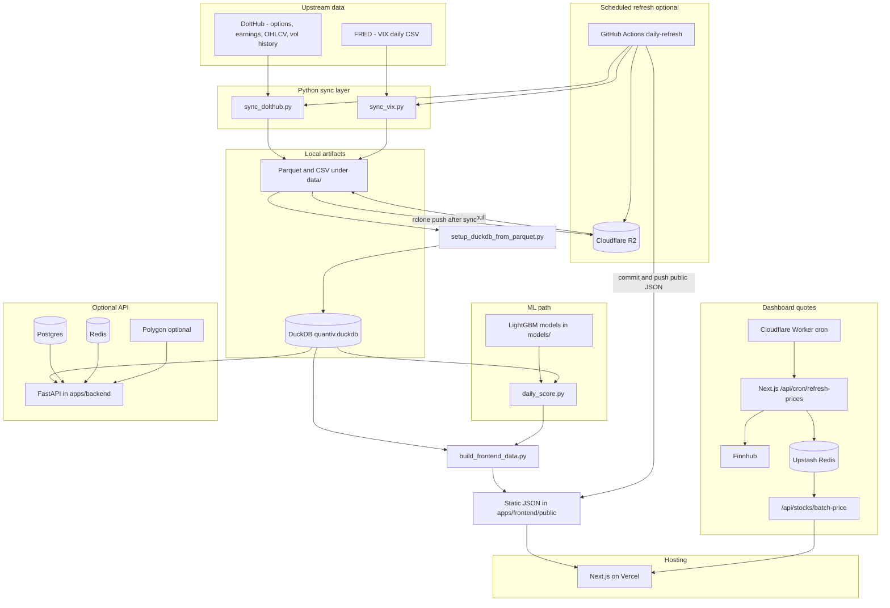

# Quantiv 📈

> Options-implied expected moves for earnings, backed by a Next.js dashboard, local market-data artifacts, and optional FastAPI/ML services.


Quantiv is a monorepo for researching and displaying expected moves around earnings. The current app combines:

- a **Next.js 14 (App Router) frontend** for weekly earnings discovery, per-symbol expected-move pages, a **watchlist**, and **Clerk**-backed sign-in where enabled,
- a **static frontend data pipeline** that generates JSON from local DuckDB/Parquet data (`tools/build_frontend_data.py`, which builds earnings views via `tools/build_earnings_events.py`),
- an optional **FastAPI backend** for expected-move, history, expiry, and ML endpoints,
- **data sync scripts** for DoltHub options, earnings, OHLCV, and **volatility history**, plus **VIX** daily closes from **FRED** (`scripts/sync_vix.py`),
- optional **LightGBM-based ML scoring** for earnings move forecasts (`scripts/daily_score.py`).

The frontend is designed to work from generated files in `apps/frontend/public`, so it can be deployed on **Vercel** without requiring the FastAPI service for the main dashboard experience. **Live quotes** on the dashboard use **Finnhub** (rate-limited) with **Upstash Redis** caching: a **Cloudflare Worker** cron hits `apps/frontend/app/api/cron/refresh-prices`, and the UI loads ticks through **`/api/stocks/batch-price`**. The FastAPI layer can still use **Polygon** when `POLYGON_API_KEY` is set (for example, optional live context on expected-move requests).

> This project is for research and educational use. It is not financial advice.

## What the app does

### Earnings dashboard

- Shows earnings for last week, this week, next week, and two weeks ahead.
- Groups earnings by day and timing: before open, after close, or other.
- Filters toward popular symbols for a cleaner dashboard.
- Links each ticker to a generated symbol detail page.

### Symbol expected-move pages

- Displays the next earnings date, timing, spot estimate/live price, and headline expected move.
- Shows ATM straddle expected move and IV-based expected move.
- Shows expected move by expiry, ATM IV, straddle price, and selected Greeks/microstructure fields when available.
- Uses precomputed JSON files generated by `tools/build_frontend_data.py`.

### Frontend API routes

- `GET /api/stocks/search?q=AAPL&limit=6` searches S&P 500 tickers for the homepage search box.
- `POST /api/stocks/batch-price` returns Finnhub-backed quotes for many symbols at once, using **Upstash Redis** (and a small in-memory layer) with stale-while-revalidate behavior.
- `GET /api/health` lightweight health check for the frontend deployment.
- Watchlist APIs under `/api/watchlist` (and per-symbol routes) for signed-in users when Clerk + database env are configured.
- `GET /api/cron/refresh-prices` (Bearer `CRON_SECRET` or `?secret=`) — invoked on a schedule (for example from `workers/refresh-prices`) to refresh the Redis quote cache from Finnhub.

### Optional FastAPI backend

The backend in `apps/backend` exposes expected-move and ML-related endpoints over Postgres, DuckDB, or hybrid data backends. It also uses Redis for caching and Polygon for optional live market data.

Key endpoints include:

```bash
GET  /health
POST /api/expected-move
GET  /em/forecast?symbol=AAPL&exp=YYYY-MM-DD
GET  /em/history?symbol=AAPL&exp=YYYY-MM-DD&window=90d
GET  /em/expiries?symbol=AAPL&window=120d
GET  /em/ml-forecast?symbol=AAPL&earnings_date=YYYY-MM-DD
GET  /em/ml-info
GET  /api/symbols
GET  /api/symbols/{symbol}/history
GET  /api/ml/info
GET  /api/ml/predict/{symbol}
GET  /api/ml/symbols
GET  /api/ml/forecasts
POST /api/admin/refresh-forecasts   # X-API-Key: ADMIN_API_KEY
```

## Architecture


```mermaid
flowchart TB
  subgraph sources["Upstream data"]
    DH["DoltHub - options, earnings, OHLCV, vol history"]
    FRED["FRED - VIX daily CSV"]
  end

  subgraph sync["Python sync layer"]
    SD[sync_dolthub.py]
    SV[sync_vix.py]
  end

  DH --> SD
  FRED --> SV

  subgraph artifacts["Local artifacts"]
    PQ[Parquet and CSV under data/]
    DUCK[(DuckDB quantiv.duckdb)]
  end

  SD --> PQ
  SV --> PQ

  subgraph ci["Scheduled refresh optional"]
    R2[(Cloudflare R2)]
    GHA[GitHub Actions daily-refresh]
  end

  R2 -->|rclone pull| PQ
  PQ -->|rclone push after sync| R2
  GHA --> SD
  GHA --> SV
  GHA --> R2

  PQ --> VIEWS[setup_duckdb_from_parquet.py]
  VIEWS --> DUCK

  subgraph ml["ML path"]
    LGBM[LightGBM models in models/]
    SCORE[daily_score.py]
  end

  LGBM --> SCORE
  DUCK --> SCORE

  DUCK --> BUILD[build_frontend_data.py]
  SCORE --> BUILD
  BUILD --> PUB["Static JSON in apps/frontend/public"]

  subgraph deploy["Hosting"]
    VERCEL[Next.js on Vercel]
  end

  PUB --> VERCEL
  GHA -->|commit and push public JSON| PUB

  subgraph quotes["Dashboard quotes"]
    CF[Cloudflare Worker cron]
    CRON["Next.js /api/cron/refresh-prices"]
    FH[Finnhub]
    UPR[(Upstash Redis)]
    BATCH["/api/stocks/batch-price"]
  end

  CF --> CRON
  CRON --> FH
  CRON --> UPR
  UPR --> BATCH
  BATCH --> VERCEL

  subgraph api["Optional API"]
    FAST[FastAPI in apps/backend]
    PG[(Postgres)]
    REDIS[(Redis)]
    POLY[Polygon optional]
  end

  DUCK --> FAST
  PG --> FAST
  REDIS --> FAST
  POLY --> FAST
```

**Nightly production path (when configured):** the [Daily data refresh](.github/workflows/daily-refresh.yml) workflow pulls Parquet (and models) from R2, runs incremental DoltHub syncs (including `--volhist`), runs `sync_vix.py`, pushes updates back to R2, rebuilds DuckDB views, runs `check_duckdb_freshness.py`, scores with `daily_score.py --days-ahead 21`, regenerates `apps/frontend/public`, and commits so Vercel redeploys. Forecast Parquet under `data/forecasts` stays out of git (see workflow comments).

## Tech stack

**Frontend**

- Next.js 14 App Router
- React 18
- TypeScript
- TailwindCSS
- Lucide icons
- Zod validation
- TanStack Query for client data flows
- Clerk for authentication (when configured)
- Upstash Redis for quote caching on Vercel; optional `DATABASE_URL` for Neon-compatible SQL used by the price cron for cursor/metadata when set

**Backend**

- FastAPI + Uvicorn
- Pydantic
- asyncpg / PostgreSQL
- DuckDB
- Redis
- HTTPX
- SlowAPI rate limiting
- Structlog logging

**Data and ML**

- Python 3.11 in CI and docs
- DuckDB
- pandas / NumPy
- PyArrow / Parquet
- scikit-learn, LightGBM (and related stack in `apps/ml/requirements.txt`)
- DoltHub sync for options chains, earnings calendar, OHLCV, and volatility history
- FRED CSV sync for VIX closes (`scripts/sync_vix.py`)

**Infrastructure**

- Docker Compose for API, Postgres, Redis, frontend, ML batch jobs, and DB index jobs
- Vercel for the Next.js app (`vercel.json`)
- Optional **Cloudflare R2** + **rclone** for large Parquet/model artifacts in GitHub Actions (`scripts/r2_pull.sh`, `scripts/r2_push.sh`)
- **GitHub Actions** [daily-refresh](.github/workflows/daily-refresh.yml) for automated sync, scoring, and public JSON commits
- **Cloudflare Worker** in `workers/refresh-prices` to trigger the Vercel cron route on a 1-minute cadence

## Project structure

```text
quantiv/
├── .github/workflows/         # CI (e.g. daily-refresh: R2, sync, DuckDB, score, build, commit public JSON)
├── apps/
│   ├── frontend/              # Next.js app, UI, API routes (search, batch-price, watchlist, cron), public JSON
│   ├── backend/               # FastAPI app, routers, models, data backends, backend Dockerfile
│   └── ml/                    # feature_engineering_v3, model_trainer_v3, Docker/requirements, training data
├── config/                    # Environment templates and local/prod env files
├── data/                      # Parquet, earnings inputs, DuckDB file, forecasts (gitignored where noted)
├── infrastructure/
│   ├── database/              # Postgres schemas, serving schemas, index jobs
│   └── docker/                # Docker Compose and frontend Docker config
├── lib/                       # Shared utilities (e.g. S&P 500 helpers, bundled constituents JSON)
├── models/                    # Trained model artifacts when present
├── scripts/                   # sync_dolthub, sync_vix, DuckDB setup, daily_score, R2 helpers, health checks
├── tools/                     # build_frontend_data.py, build_earnings_events.py, EM helpers
├── workers/                   # Cloudflare Worker stub for cron → Vercel refresh-prices
├── package.json               # Root npm workspace scripts
├── requirements.txt           # Python deps for data/ML scripts and GitHub Actions jobs
├── vercel.json                # Vercel frontend deployment config
└── README.md
```

## Prerequisites

- Node.js 18+ and npm
- Python 3.11 recommended
- Docker and Docker Compose for containerized services
- Optional: Polygon API key for FastAPI live context
- Optional: Finnhub, Upstash Redis, `CRON_SECRET`, and (for cron cursor SQL) `DATABASE_URL` for the hosted quote refresh path
- Optional: Postgres and Redis for the FastAPI service
- Local data in `data/` if you want to generate dashboard artifacts without resyncing from DoltHub

## Environment setup

Next.js (`apps/frontend/next.config.js`) and the FastAPI entrypoint (`apps/backend/main.py`) load **`config/.env.local`** in development (and `config/.env.production` when `NODE_ENV` or `ENVIRONMENT` is `production`). Vercel and other hosts inject variables from their dashboards instead.

Create a local file from the repo template:

```bash
cp .env.example config/.env.local
```

Edit `config/.env.local` with your keys. The checked-in [`.env.example`](.env.example) lists every variable with short comments; highlights:

| Area | Variables |
|------|-----------|
| Public app URLs | `NEXT_PUBLIC_APP_URL`, `NEXT_PUBLIC_API_URL` |
| Clerk (watchlist auth) | `NEXT_PUBLIC_CLERK_PUBLISHABLE_KEY`, `CLERK_SECRET_KEY` |
| Dashboard quotes | `FINNHUB_API_KEY`, `UPSTASH_REDIS_REST_URL`, `UPSTASH_REDIS_REST_TOKEN`, `CRON_SECRET` |
| SQL for cron / watchlist | `DATABASE_URL` (optional; Neon-compatible when using serverless Postgres) |
| FastAPI data + cache | `DATA_BACKEND`, `DATA_DIR`, `DUCKDB_PATH`, Postgres fields, `REDIS_URL` (TCP `redis://` for the API, not Upstash REST) |
| Live options context | `POLYGON_API_KEY` (optional) |
| Admin | `ADMIN_API_KEY` (`X-API-Key` on refresh-forecasts) |
| Custom CORS | `FRONTEND_URL` |

The Cloudflare Worker in `workers/refresh-prices` uses **Wrangler secrets** (`REFRESH_URL`, `CRON_SECRET`) — see that folder’s README, not `config/.env.local`.

## Quick start: frontend dashboard

Install JavaScript dependencies:

```bash
npm install
```

Install Python dependencies for data-building scripts. One practical local setup is:

```bash
python -m venv .venv
source .venv/bin/activate
pip install -r apps/backend/requirements.txt
pip install -r apps/ml/requirements.txt
```

Generate the frontend JSON artifacts from local data:

```bash
npm run data:frontend
```

Then start the frontend:

```bash
npm run dev
```

Open:

```text
http://localhost:3000
```

The dashboard expects generated files such as:

```text
apps/frontend/public/weekly.json
apps/frontend/public/weeks/*.json
apps/frontend/public/weeks/manifest.json
apps/frontend/public/symbols/*.json
```

If those files are missing, run the data workflow below first.

## Data workflow

Quantiv's frontend data generator reads local options and earnings data, builds expected-move artifacts, and writes static JSON for the Next.js app.

### 1. Sync data from DoltHub

```bash
# Check DoltHub/local sync status
npm run data:sync -- --dry-run

# Sync recent options data incrementally
npm run data:sync

# Sync a date range
npm run data:sync -- --full --start-date 2024-01-01 --end-date 2024-01-31

# Sync earnings calendar
npm run data:sync -- --earnings

# Sync OHLCV data
npm run data:sync -- --ohlcv

# Sync volatility history (DoltHub)
npm run data:sync -- --volhist
```

**VIX (FRED):** not wired to `npm run data:sync`; refresh closes with:

```bash
python scripts/sync_vix.py
```

The nightly GitHub workflow runs both `--volhist` and `sync_vix.py` after DoltHub steps.

### 2. Build DuckDB views over Parquet

```bash
npm run data:views
```

This creates views such as options-chain, ATM options, straddle features, earnings, OHLCV, realized-volatility, and IV/RV feature views when the needed inputs exist.

### 3. Generate frontend JSON

```bash
npm run data:frontend
```

This writes weekly earnings files and per-symbol detail files into `apps/frontend/public`.

## Backend development

Start the backend directly:

```bash
npm run dev:backend
```

Or run it from the backend directory:

```bash
cd apps/backend
python main.py
```

Open:

```text
http://localhost:8000/docs
http://localhost:8000/health
```

For `DATA_BACKEND=duckdb`, make sure `DUCKDB_PATH` points to an existing DuckDB file or a file that can be initialized from local data. For `DATA_BACKEND=postgres` or `hybrid`, configure either `DATABASE_URL` or the individual Postgres variables.

## Docker development

Start the default containerized services:

```bash
npm run docker:up
```

This uses `infrastructure/docker/docker-compose.yml` and starts the unprofiled services such as API, Postgres, and Redis.

Start the frontend service through the Compose `dev` profile:

```bash
docker compose -f infrastructure/docker/docker-compose.yml --profile dev up frontend
```

Run the ML batch container through the `batch` profile:

```bash
docker compose -f infrastructure/docker/docker-compose.yml --profile batch up ml-pipeline
```

Stop services:

```bash
npm run docker:down
```

## ML workflow

The repository includes scripts and dependencies for LightGBM-based earnings-move scoring.

Useful commands:

```bash
# Generate ML scores for upcoming earnings
npm run ml:score

# Validate data health
npm run ml:validate

# Feature / train pipelines (see apps/ml/)
npm run ml:features
npm run ml:train
```

`npm run ml:features` and `npm run ml:train` run `apps/ml/feature_engineering_v3.py` and `apps/ml/model_trainer_v3.py`. `scripts/daily_score.py` expects trained model artifacts under the configured data/model paths and writes forecast outputs to local Parquet and DuckDB tables (CI uses `python scripts/daily_score.py --days-ahead 21` after a DuckDB freshness gate).

## Root npm scripts

```bash
# Frontend
npm run dev
npm run dev:frontend
npm run build
npm run build:frontend
npm run start
npm run lint
npm run type-check
npm run test

# Backend
npm run dev:backend

# Docker
npm run docker:up
npm run docker:down

# Data
npm run data:sync
npm run data:sync-full
npm run data:earnings
npm run data:ohlcv
npm run data:csv-parquet
npm run data:views
npm run data:frontend

# ML
npm run ml:features
npm run ml:train
npm run ml:score
npm run ml:validate
```

## Deployment notes

`vercel.json` is configured to deploy the frontend workspace:

```bash
npm install
npm run build --workspace=apps/frontend
```

Vercel serves the generated frontend output from `apps/frontend/.next`. The main dashboard depends on static files in `apps/frontend/public` (either committed or produced by `tools/build_frontend_data.py`). In the full hosted setup, **GitHub Actions** can refresh that directory nightly and push to `main`, which triggers a new Vercel deployment; large Parquet and model blobs can stay in **Cloudflare R2** instead of the git repo.

## Accuracy notes

- The current UI's headline expected move is primarily generated from ATM straddle and IV-baseline calculations unless ML forecast fields are explicitly generated and wired into the artifact.
- The frontend dashboard uses generated JSON files rather than querying the FastAPI backend for every page view.
- Dashboard **spot quotes** come from **Finnhub** via **`/api/stocks/batch-price`** and the **cron** refresh path, cached in **Redis** when env vars are set; there is no separate per-symbol Polygon route on the Next.js app.
- The FastAPI backend can still use **Polygon** when `POLYGON_API_KEY` is set (for example optional live fields on `/api/expected-move` with `include_live`). It remains useful for expected-move records, history, expiries, symbol lists, and ML HTTP endpoints when Postgres/DuckDB/Redis are configured.

## License

This project is licensed under the GNU General Public License v3.0. See [`LICENSE`](LICENSE) for details.
