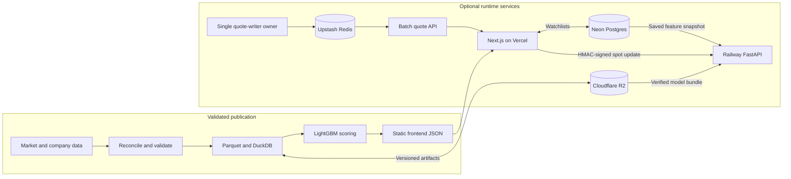

# Quantiv 📈

> Decision-ready earnings research: market pricing, historical outcomes, and calibrated ML in one fast, auditable dashboard.


Quantiv turns fragmented earnings, options, volatility, price, and company data into three clear answers for every ticker: **What move is the market pricing? What happened after similar earnings? What does the model estimate?** Each answer includes the uncertainty, freshness, and quote-quality context needed to judge it.

Under the hood, a Python pipeline reconciles provider data, validates every publishable snapshot, and generates static JSON. Public research pages therefore stay fast and available without waiting on a database or model server. Optional services add cached live stock quotes, authenticated watchlists, and controlled model re-scoring with an updated stock price.

> **Research and educational use only. Quantiv does not provide financial advice or execution-ready signals.**

## At a glance

- 120,000+ historical earnings records
- 10,000+ searchable ticker identities
- Approximately 100 monthly active users
- Market pricing, model estimates, and event history in one research view
- Validated nightly snapshots with cached live stock quotes
- Bad data and weak models blocked before publication—without another always-on service

| Surface             | Route        | Purpose                                                                                 |
| ------------------- | ------------ | --------------------------------------------------------------------------------------- |
| Earnings calendar   | `/`          | Browse previous and upcoming earnings weeks                                             |
| Screener            | `/screener`  | Search and compare earnings events in a virtualized table                               |
| Symbol research     | `/[symbol]`  | Compare market pricing, model estimates, history, term structure, Greeks, and scenarios |
| Watchlist           | `/watchlist` | Save, reorder, price, and score tracked symbols                                         |
| Methodology         | `/about`     | Review formulas, data sources, and interpretation                                       |
| Production controls | `/ml-status` | Inspect data, model, serving, and release exceptions                                    |

## Built to earn trust

Institutional research software is credible only when every displayed number is timely, reproducible, and safe to interpret. Quantiv makes those requirements part of the publication path:

- **Data integrity:** reconciliation checks freshness, expected-versus-received rows, duplicates, symbol mappings, corporate actions, quarantines, and deterministic replay.
- **Usable market inputs:** option controls reject crossed, stale, excessively wide, invalid-IV, and otherwise commercially unusable quotes.
- **Model risk:** challengers must pass purged chronological, walk-forward, straddle-baseline, calibration, drift, shadow-scoring, and forecast-handoff gates.
- **Artifact security:** native LightGBM bundles are content-addressed, signed, digest-verified, and atomically activated.
- **Fail-closed releases:** a critical failure stops scoring or publication while the last validated release remains available.

### Measured evidence

Latest `main` CI evidence as of September 1, 2026:

- **366 passing checks:** 121 frontend, 19 quote-worker, 127 backend/ML, 81 pipeline/tool, 16 Playwright, and 2 performance tests.
- **724 ms lab FCP p90 and worst-sample proxy** across seven production-build loads, against a 1.8 s budget. Production Speed Insights remains the source of truth for real-user p90/p99.
- Railway image health, public production smoke tests, and Python/JavaScript CodeQL checks pass independently.

The decision boundary is explicit: a current stock price may refresh spot-derived inputs, but it does not make the frozen options snapshot intraday or live-trading eligible. See [Decision scope](docs/DECISION_SCOPE.md).

## A small, production-focused architecture

Most user traffic reads immutable, prebuilt research artifacts. Stateful infrastructure is reserved for the few features that need it: watchlists, cached quotes, and optional spot-updated inference.


```mermaid
flowchart LR
  subgraph publication["Validated publication"]
    SOURCES["Market and company data"] --> RECON["Reconcile and validate"]
    RECON --> DATA["Parquet and DuckDB"]
    DATA --> SCORE["LightGBM scoring"]
    SCORE --> JSON["Static frontend JSON"]
  end

  DATA <-->|Versioned artifacts| R2[(Cloudflare R2)]
  JSON --> WEB["Next.js on Vercel"]

  subgraph runtime["Optional runtime services"]
    WRITER["Single quote-writer owner"] --> REDIS[(Upstash Redis)]
    REDIS --> QUOTES["Batch quote API"] --> WEB
    WEB <-->|Watchlists| NEON[(Neon Postgres)]
    WEB -->|HMAC-signed spot update| API["Railway FastAPI"]
    NEON -->|Saved feature snapshot| API
    R2 -->|Verified model bundle| API
  end
```

The production system has three deliberately narrow paths:

1. **Static publication** keeps the primary research experience fast and resilient.
2. **Spot-updated inference** substitutes only the latest stock price into a saved end-of-day feature vector, then scores the signed champion model.
3. **Live quotes** use one lease-elected regular-hours writer; explicit fallbacks take over only when the owner is absent.

This design keeps operating cost and failure surface small while preserving a reproducible data and model trail.

See [System architecture](docs/ARCHITECTURE.md) for providers, routes, schedules, and service responsibilities.

## Technology

| Layer          | Technologies                                     |
| -------------- | ------------------------------------------------ |
| Web            | Next.js 15, React 18, TypeScript, Tailwind CSS   |
| API            | Vercel API routes; optional FastAPI on Railway   |
| Data           | Python 3.11, DuckDB, Parquet, Cloudflare R2      |
| ML             | LightGBM native model format                     |
| Persistence    | Neon Postgres, Upstash Redis                     |
| Authentication | Clerk                                            |
| Automation     | GitHub Actions and a Cloudflare fallback trigger |

## Repository structure

```text
quantiv/
├── apps/
│   ├── frontend/           # Next.js UI, API routes, and generated public data
│   ├── backend/            # FastAPI prediction service and quote worker
│   └── ml/                 # Features, training, validation, and model controls
├── config/                 # Local environment files; gitignored
├── data/                   # CSV, Parquet, DuckDB, and validation artifacts
├── docs/                   # Architecture, controls, deployment, and performance
├── lib/                    # Shared ticker and index metadata
├── scripts/                # Ingestion, reconciliation, scoring, and operations
├── tools/                  # Frontend-data and metadata builders
├── workers/refresh-prices/ # Cloudflare trigger for quote-writer failover
├── railway.toml
├── railway.worker.toml
├── vercel.json
└── package.json
```

Experimental and retired code is isolated under `scripts/research/`, `scripts/archive/`, and `apps/ml/archive/` rather than included in the production path.

## Local development

Requirements:

- Node.js 20+
- npm
- Python 3.11
- Local data artifacts or access to the configured R2 bucket
- Neon `DATABASE_URL` only when working on watchlists or imported forecasts

Install dependencies and create the local environment:

```bash
npm install
python -m venv .venv
source .venv/bin/activate
pip install -r requirements.txt
cp .env.example config/.env.local
```

On Windows, activate Python with `.venv\Scripts\Activate.ps1`. Add only the credentials required for the services you are running; the complete inventory is documented in [.env.example](.env.example).

After local data and DuckDB views are available:

```bash
npm run data:frontend
npm run dev
```

The frontend runs at `http://localhost:3000`. Start the optional FastAPI service with `npm run dev:backend`; its API documentation is at `http://localhost:8000/docs`.

For Neon-backed features, apply migrations with:

```bash
node scripts/migrate.mjs
```

## Data and ML workflows

Run the manual data path in dependency order:

```bash
npm run data:sync
npm run data:earnings:finnhub
npm run data:earnings:fmp
python scripts/check_earnings_calendar_integrity.py
npm run data:views
npm run ml:score
npm run data:frontend
```

Use `npm run data:sync-full` for the expanded synchronization workflow. Generated application data is written to `apps/frontend/public/`.

Common model-development commands:

```bash
npm run ml:features
npm run ml:train
npm run ml:score
npm run ml:validate
npm run ml:walk-forward
```

The manual `ml:walk-forward` command is a research diagnostic. Scheduled retraining uses mandatory production walk-forward and promotion gates documented in [Model control plane](docs/MODEL_CONTROL_PLANE.md).

## Verification and automation

Run the main local checks with:

```bash
npm run lint
npm run type-check
npm test -- --run
npm run test:e2e --workspace=apps/frontend
python -m pytest apps/backend/tests apps/ml/tests scripts tools -q
```

| Workflow                   | Purpose                                                                                   |
| -------------------------- | ----------------------------------------------------------------------------------------- |
| `ci.yml`                   | Lint, type-check, build, pytest, Vitest, Playwright, performance, and Railway image smoke |
| `security.yml`             | Python and JavaScript/TypeScript CodeQL analysis                                          |
| `production-smoke.yml`     | Public frontend and API checks                                                            |
| `daily-refresh.yml`        | Provider refresh, reconciliation, scoring, publication, and Sunday challenger training    |
| `refresh-broad.yml`        | Off-hours Polygon quote-cache warming                                                     |
| `refresh-ticker-names.yml` | Quarterly SEC ticker and exchange refresh                                                 |
| `av-enrichment.yml`        | Manual, isolated provider-signal research; never publishes to `main`                      |

## Documentation

| Document                                                             | Topic                                                          |
| -------------------------------------------------------------------- | -------------------------------------------------------------- |
| [Architecture](docs/ARCHITECTURE.md)                                 | Production paths, providers, services, routes, and schedules   |
| [Decision scope](docs/DECISION_SCOPE.md)                             | End-of-day versus spot-updated input boundary                  |
| [Reconciliation control plane](docs/RECONCILIATION_CONTROL_PLANE.md) | Data quality, quote eligibility, replay, and publication gates |
| [Model control plane](docs/MODEL_CONTROL_PLANE.md)                   | Signed bundles, promotion, monitoring, and rollback            |
| [Evidence receipts](docs/EVIDENCE_RECEIPTS.md)                       | Reproducible run and artifact evidence                         |
| [Performance](docs/PERFORMANCE.md)                                   | FCP budget, verification, and production monitoring            |
| [Railway setup](docs/RAILWAY_SETUP.md)                               | API and quote-worker deployment                                |
| [R2 setup](docs/R2_SETUP.md)                                         | Artifact storage and synchronization                           |
| [Pipeline runbook](scripts/README.md)                                | Data-provider and scheduled-pipeline commands                  |

Additional documentation is indexed in [docs/README.md](docs/README.md).

## License

Quantiv is licensed under the GNU General Public License v3.0. See [LICENSE](LICENSE).
