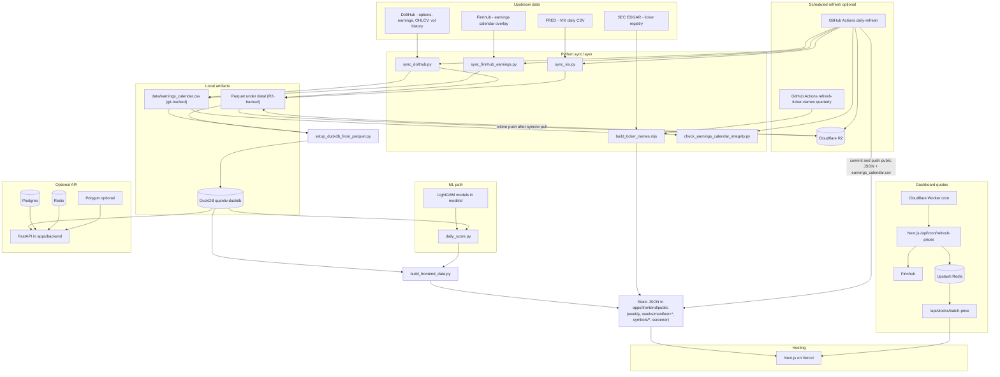

# Quantiv 📈

> Options-implied expected moves around earnings: a Next.js dashboard over prebuilt JSON, optional FastAPI APIs, and a Python data + ML path (DuckDB / Parquet / LightGBM).


Quantiv is a monorepo for **researching and displaying** expected moves into earnings: weekly calendar, per-symbol detail (straddle vs IV-based move, expiries when data exists), optional **watchlist** and **Clerk** auth, and **Finnhub + Upstash** live quotes (`/api/stocks/batch-price`, cron in `workers/refresh-prices`). Earnings data is a blend of a **DoltHub** historical baseline and a **Finnhub** near-term overlay merged into a git-tracked `data/earnings_calendar.csv`, gated nightly by `scripts/check_earnings_calendar_integrity.py`. Static JSON under `apps/frontend/public` is produced by `tools/build_frontend_data.py` so the UI can ship on **Vercel** without hitting FastAPI on every navigation. Optional **FastAPI** (`apps/backend`) adds expected-move / history / ML HTTP endpoints over **Postgres, DuckDB, or hybrid**, with **Redis** cache and optional **Polygon** for live context on some routes.

> Research and educational use only — not financial advice.

## What the app does

- **Dashboard** — Last / this / next / +2 weeks; group by day and BMO / AMC / other; filters (popular, S&P 500, movers, all); links to symbol pages.
- **Symbol pages** — Next earnings, timing, quotes, headline EM; straddle vs IV; by expiry when available; driven by generated JSON + live batch-price.
- **APIs (frontend)** — Search, batch quotes, watchlist routes when configured, `/api/cron/refresh-prices` (Bearer `CRON_SECRET`). Backend route list: `apps/backend/routers/em.py` (e.g. `/health`, `/api/expected-move`, `/em/*`, `/api/ml/*`, admin refresh).

## Architecture


```mermaid
flowchart TB
  subgraph sources["Upstream data"]
    DH["DoltHub - options, earnings, OHLCV, vol history"]
    FH_E["Finnhub - earnings calendar overlay"]
    FRED["FRED - VIX daily CSV"]
    SEC["SEC EDGAR - ticker registry"]
  end

  subgraph sync["Python sync layer"]
    SD[sync_dolthub.py]
    SFE[sync_finnhub_earnings.py]
    SV[sync_vix.py]
    BTN[build_ticker_names.mjs]
    GATE[check_earnings_calendar_integrity.py]
  end

  DH --> SD
  FH_E --> SFE
  FRED --> SV
  SEC --> BTN

  subgraph artifacts["Local artifacts"]
    EC["data/earnings_calendar.csv (git-tracked)"]
    PQ["Parquet under data/ (R2-backed)"]
    DUCK[(DuckDB quantiv.duckdb)]
  end

  SD --> EC
  SFE --> EC
  EC --> GATE
  SD --> PQ
  SV --> PQ

  subgraph ci["Scheduled refresh optional"]
    R2[(Cloudflare R2)]
    GHA[GitHub Actions daily-refresh]
    RTN[GitHub Actions refresh-ticker-names quarterly]
  end

  R2 -->|rclone pull| PQ
  PQ -->|rclone push after sync| R2
  GHA --> SD
  GHA --> SFE
  GHA --> SV
  GHA --> GATE
  GHA --> R2
  RTN --> BTN

  PQ --> VIEWS[setup_duckdb_from_parquet.py]
  EC --> VIEWS
  VIEWS --> DUCK

  subgraph ml["ML path"]
    LGBM[LightGBM models in models/]
    SCORE[daily_score.py]
  end

  LGBM --> SCORE
  DUCK --> SCORE

  DUCK --> BUILD[build_frontend_data.py]
  SCORE --> BUILD
  BUILD --> PUB["Static JSON in apps/frontend/public (weekly, weeks/manifest+*, symbols/*, screener)"]
  BTN --> PUB

  subgraph deploy["Hosting"]
    VERCEL[Next.js on Vercel]
  end

  PUB --> VERCEL
  GHA -->|commit and push public JSON + earnings_calendar.csv| PUB

  subgraph quotes["Dashboard quotes"]
    CF[Cloudflare Worker cron]
    CRON["Next.js /api/cron/refresh-prices"]
    FH[Finnhub]
    UPR[(Upstash Redis)]
    BATCH["/api/stocks/batch-price"]
  end

  CF --> CRON
  CRON --> FH
  CRON --> UPR
  UPR --> BATCH
  BATCH --> VERCEL

  subgraph api["Optional API"]
    FAST[FastAPI in apps/backend]
    PG[(Postgres)]
    REDIS[(Redis)]
    POLY[Polygon optional]
  end

  DUCK --> FAST
  PG --> FAST
  REDIS --> FAST
  POLY --> FAST
```

**Nightly path:** [.github/workflows/daily-refresh.yml](.github/workflows/daily-refresh.yml) (cron `0 11 * * *` = 07:00 ET) pulls Parquet + models from R2, runs `sync_dolthub.py` (options / earnings / ohlcv / volhist), overlays near-term earnings via `sync_finnhub_earnings.py` when `FINNHUB_API_KEY` is set (Sundays do a full-universe sweep), runs the **integrity gate** (`scripts/check_earnings_calendar_integrity.py`) — if it trips, the commit step is skipped to avoid shipping a regressed CSV — pushes Parquet back to R2, rebuilds DuckDB views, runs `check_duckdb_freshness.py`, `daily_score.py --days-ahead 21`, regenerates `apps/frontend/public/{weekly,weeks/*,symbols/*,screener}.json`, commits `apps/frontend/public/` + `data/earnings_calendar.csv`, and pushes so Vercel redeploys. Weekly LightGBM retrain runs on the same workflow at `0 12 * * 0` (Sun 12:00 UTC). Forecast parquet under `data/forecasts` stays out of git.

**Quarterly path:** [.github/workflows/refresh-ticker-names.yml](.github/workflows/refresh-ticker-names.yml) (cron `0 6 1 */3 *`) pulls SEC EDGAR registries via `scripts/build_ticker_names.mjs`, writes `apps/frontend/public/ticker-names.json` + `ticker-exchanges.json`, and commits.

## Tech stack

| Area | Notes |
|------|--------|
| **Frontend** | Next.js 15 App Router, React 18, TypeScript, Tailwind, Zod, TanStack Query, Clerk when enabled |
| **Backend** | FastAPI, Pydantic, asyncpg, DuckDB, Redis, HTTPX, SlowAPI, structlog |
| **Data / ML** | Python 3.11 in CI, pandas / PyArrow / Parquet, DuckDB, LightGBM + sklearn stack in `apps/ml/requirements.txt` |
| **Infra** | Docker Compose, Vercel, optional R2 + rclone (`scripts/r2_*.sh`), GitHub Actions (`ci.yml`, `daily-refresh.yml`, `refresh-ticker-names.yml`), Cloudflare Worker in `workers/refresh-prices` |

## Project structure

```text
quantiv/
├── apps/
│   ├── frontend/          # Next.js 15 UI, API routes, public JSON artifacts
│   ├── backend/           # FastAPI, routers, data backends, Dockerfile
│   └── ml/                # feature_engineering_v3, model_trainer_v3, training assets
├── config/                # .env.local / .env.production (see .env.example at repo root)
├── data/                  # Parquet, DuckDB, inputs; earnings_calendar.csv is git-tracked
├── infrastructure/        # docker-compose, database helpers
├── lib/                   # Shared TS + bundled data (e.g. S&P 500 list)
├── models/                # Trained artifacts when present (also synced to R2)
├── scripts/               # sync_dolthub, sync_finnhub_earnings, sync_vix, DuckDB setup,
│                          # daily_score, walk_forward, R2, healthchecks + integrity gate
├── tools/                 # build_frontend_data, build_earnings_events, patch_timing,
│                          # math_baseline (EM helpers)
├── workers/               # Cron → Vercel refresh-prices (Wrangler secrets)
├── .github/workflows/     # ci.yml, daily-refresh.yml, refresh-ticker-names.yml
├── package.json           # npm workspaces + data / ML script aliases
├── requirements.txt       # Python deps for CI / scripts
└── vercel.json
```

## Prerequisites

- Node 18+, npm  
- Python 3.11 recommended  
- Docker + Compose if you use the bundled stack  
- Local `data/` (or sync from DoltHub) to build dashboard JSON  
- Optional: Finnhub + Upstash + `CRON_SECRET` (+ `DATABASE_URL` for cron cursor) for hosted quotes; Polygon / Postgres / Redis for FastAPI modes — see [.env.example](.env.example)

## Environment

Next.js (`apps/frontend/next.config.js`) and FastAPI (`apps/backend/main.py`) load **`config/.env.local`** in dev (and `config/.env.production` when `NODE_ENV` / `ENVIRONMENT` is production). Hosts inject vars in prod.

```bash
cp .env.example config/.env.local
```

Variables are documented inline in [.env.example](.env.example) (URLs, Clerk, Finnhub/Upstash, `DATA_BACKEND`, DuckDB paths, Postgres, `REDIS_URL`, `ADMIN_API_KEY`, etc.). The Cloudflare Worker uses **Wrangler secrets** (`REFRESH_URL`, `CRON_SECRET`) — see `workers/refresh-prices/README.md`.

## Quick start (dashboard)

```bash
npm install
python -m venv .venv && source .venv/bin/activate   # optional
pip install -r requirements.txt                   # and/or apps/backend + apps/ml requirements
npm run data:frontend                             # after data + DuckDB exist
npm run dev                                       # http://localhost:3000
```

Expected artifacts include `apps/frontend/public/weekly.json`, `weeks/*.json`, `weeks/manifest.json`, and `symbols/*.json`. If they are missing, run the **Data workflow** below.

## Data workflow

1. **DoltHub sync** — `npm run data:sync` (options); add `--earnings`, `--ohlcv`, `--volhist`; full ranges with `npm run data:sync-full -- --start-date … --end-date …`. VIX: `python scripts/sync_vix.py` (not on the default npm sync alias).
2. **Finnhub overlay** — `npm run data:earnings:finnhub -- --symbols AAPL,MSFT` (or `--all-recent` to sweep the universe, respecting Finnhub's 60 calls/min cap via the built-in `CallBudget` and `--delay`). Merges into `data/earnings_calendar.csv` non-destructively, preserving DoltHub historicals.
3. **Integrity check** — `python scripts/check_earnings_calendar_integrity.py` compares the working CSV against HEAD and trips guardrails on row drops, vanished tickers, US-only vanished events in past 30d / next 60d, with a ±14d date-drift rescue and a foreign-symbol exclusion. CI runs this before any auto-commit; pass `--warn-only` to override.
4. **DuckDB views** — `npm run data:views` (`scripts/setup_duckdb_from_parquet.py`).
5. **Frontend JSON** — `npm run data:frontend` → `apps/frontend/public`.

## Backend & Docker

```bash
npm run dev:backend          # or: cd apps/backend && python main.py
# http://localhost:8000/docs   http://localhost:8000/health
```

Set `DATA_BACKEND` to `duckdb`, `postgres`, or `hybrid` and configure `DUCKDB_PATH` / `DATABASE_URL` / discrete Postgres vars and `REDIS_URL` as needed.

```bash
npm run docker:up            # infrastructure/docker/docker-compose.yml
npm run docker:down
```

Compose profiles exist for frontend dev and ML batch — see comments in the compose file.

## ML

```bash
npm run ml:features      # apps/ml/feature_engineering_v3.py
npm run ml:train         # apps/ml/model_trainer_v3.py
npm run ml:walk-forward  # scripts/walk_forward.py
npm run ml:score         # scripts/daily_score.py
npm run ml:validate      # scripts/data_healthcheck.py --local
```

Training / scoring details: [scripts/README.md](scripts/README.md).

## npm scripts (high level)

| Group | Commands |
|-------|----------|
| Frontend | `dev`, `build`, `lint`, `type-check`, `test` (workspace `apps/frontend`) |
| Backend | `dev:backend` |
| Docker | `docker:up`, `docker:down` |
| Data | `data:sync`, `data:sync-full`, `data:earnings`, `data:earnings:finnhub`, `data:ohlcv`, `data:csv-parquet`, `data:views`, `data:frontend` |
| ML | `ml:features`, `ml:train`, `ml:walk-forward`, `ml:score`, `ml:validate` |

See root **package.json** for the exact command lines.

## Deployment

Vercel builds `apps/frontend` (`vercel.json`). The app reads static JSON from `apps/frontend/public` (committed or produced by `build_frontend_data`). CI can refresh that tree nightly and push to `main`; heavy Parquet/models can live on **R2** instead of git.

## Accuracy

- Headline EM in the UI is mainly straddle / IV-baseline unless ML fields are wired into the same artifacts.
- The dashboard does not call FastAPI for every page — it uses generated JSON.
- Spot quotes on Next.js use Finnhub + Upstash Redis caching, not a per-ticker Polygon route; Polygon remains optional on the FastAPI side.
- Earnings dates and timing (BMO / AMC / DMH) come from DoltHub for historicals and Finnhub for the rolling near-term window; Finnhub wins deterministically on the upcoming overlap to avoid double-projecting the same quarter.
- The dashboard's **Popular** filter is a generated weight table at `apps/frontend/lib/popular.ts` thresholded at `>= 76`, based on a rank blend of 90-day dollar volume and market cap. Watchlist / search use the separate S&P 500 list in `lib/data/sp500-constituents.json`.

## Documentation

Longer design / ML write-ups: [docs/README.md](docs/README.md) (index of `docs/*.md`). ML MVP2 archive: [docs/ML_MVP2.md](docs/ML_MVP2.md).

## License

GPL-3.0 — see [LICENSE](LICENSE).
