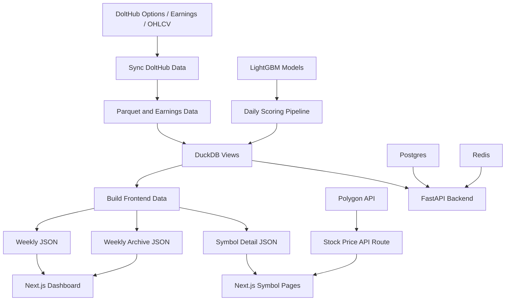

# Quantiv 📈

> Options-implied expected moves for earnings, backed by a Next.js dashboard, local market-data artifacts, and optional FastAPI/ML services.


Quantiv is a monorepo for researching and displaying expected moves around earnings. The current app combines:

- a **Next.js 14 frontend** for weekly earnings discovery and per-symbol expected-move pages,
- a **static frontend data pipeline** that generates JSON from local DuckDB/Parquet data,
- an optional **FastAPI backend** for expected-move, history, expiry, and ML endpoints,
- **data sync scripts** for DoltHub options, earnings, and OHLCV data,
- optional **LightGBM-based ML scoring** for earnings move forecasts.

The frontend is designed to work from generated files in `apps/frontend/public`, so it can be deployed on Vercel without requiring the FastAPI service for the main dashboard experience. Live/previous-close stock prices can be added through Polygon when `POLYGON_API_KEY` is configured.

> This project is for research and educational use. It is not financial advice.

## What the app does

### Earnings dashboard

- Shows earnings for last week, this week, next week, and two weeks ahead.
- Groups earnings by day and timing: before open, after close, or other.
- Filters toward popular symbols for a cleaner dashboard.
- Links each ticker to a generated symbol detail page.

### Symbol expected-move pages

- Displays the next earnings date, timing, spot estimate/live price, and headline expected move.
- Shows ATM straddle expected move and IV-based expected move.
- Shows expected move by expiry, ATM IV, straddle price, and selected Greeks/microstructure fields when available.
- Uses precomputed JSON files generated by `tools/build_frontend_data.py`.

### Frontend API routes

- `GET /api/stocks/search?q=AAPL&limit=6` searches S&P 500 tickers for the homepage search box.
- `GET /api/stocks/price?symbol=AAPL` fetches a Polygon stock snapshot when available, with a previous-close fallback and short in-memory cache.

### Optional FastAPI backend

The backend in `apps/backend` exposes expected-move and ML-related endpoints over Postgres, DuckDB, or hybrid data backends. It also uses Redis for caching and Polygon for optional live market data.

Key endpoints include:

```bash
GET  /health
POST /api/expected-move
GET  /em/forecast?symbol=AAPL&exp=YYYY-MM-DD
GET  /em/history?symbol=AAPL&exp=YYYY-MM-DD&window=90d
GET  /em/expiries?symbol=AAPL&window=120d
GET  /em/ml-forecast?symbol=AAPL&earnings_date=YYYY-MM-DD
GET  /em/ml-info
GET  /api/symbols
GET  /api/ml/info
POST /api/admin/refresh-forecasts
```

## Architecture


```mermaid
graph TD
    A[DoltHub Options / Earnings / OHLCV] --> B[Sync DoltHub Data]
    B --> C[Parquet and Earnings Data]
    C --> D[DuckDB Views]
    D --> E[Build Frontend Data]
    E --> F[Weekly JSON]
    E --> G[Weekly Archive JSON]
    E --> H[Symbol Detail JSON]
    F --> I[Next.js Dashboard]
    G --> I
    H --> J[Next.js Symbol Pages]
    K[Polygon API] --> L[Stock Price API Route]
    L --> J
    D --> M[FastAPI Backend]
    N[Postgres] --> M
    O[Redis] --> M
    P[LightGBM Models] --> Q[Daily Scoring Pipeline]
    Q --> D
```

## Tech stack

**Frontend**

- Next.js 14 App Router
- React 18
- TypeScript
- TailwindCSS
- Lucide icons
- Zod validation
- TanStack Query dependencies available for client data flows

**Backend**

- FastAPI + Uvicorn
- Pydantic
- asyncpg / PostgreSQL
- DuckDB
- Redis
- HTTPX
- SlowAPI rate limiting
- Structlog logging

**Data and ML**

- Python
- DuckDB
- pandas / NumPy
- PyArrow / Parquet
- scikit-learn, LightGBM, XGBoost dependencies
- DoltHub sync scripts for options chains, earnings calendar, and OHLCV data

**Infrastructure**

- Docker Compose for API, Postgres, Redis, frontend, ML batch jobs, and DB index jobs
- Vercel config for frontend deployment from `apps/frontend`

## Project structure

```text
quantiv/
├── apps/
│   ├── frontend/              # Next.js app, UI components, frontend API routes, public JSON artifacts
│   ├── backend/               # FastAPI app, routers, models, data backends, backend Dockerfile
│   └── ml/                    # ML Docker/requirements and batch-oriented ML dependencies
├── config/                    # Environment templates and local/prod env files
├── data/                      # Local data artifacts: Parquet, earnings CSV/Parquet, DuckDB, generated data inputs
├── infrastructure/
│   ├── database/              # Postgres schemas, serving schemas, index jobs
│   └── docker/                # Docker Compose and frontend Docker config
├── lib/                       # Shared frontend/server utilities, including stock/S&P 500 lookup helpers
├── models/                    # Trained model artifacts when present
├── scripts/                   # Data sync, DuckDB setup, ML scoring, validation, conversion scripts
├── tools/                     # Frontend JSON generation and expected-move helper scripts
├── package.json               # Root npm workspace scripts
├── vercel.json                # Vercel frontend deployment config
└── README.md
```

## Prerequisites

- Node.js 18+ and npm
- Python 3.11 recommended
- Docker and Docker Compose for containerized services
- Optional: Polygon API key for live/previous-close stock prices
- Optional: Postgres and Redis for the FastAPI service
- Local data in `data/` if you want to generate dashboard artifacts without resyncing from DoltHub

## Environment setup

Create a local environment file:

```bash
cp config/.env.example config/.env.local
```

Common variables:

```bash
# Frontend
NEXT_PUBLIC_APP_URL=http://localhost:3000
NEXT_PUBLIC_API_URL=http://localhost:8000

# Market data
POLYGON_API_KEY=
FMP_API_KEY=

# Backend data mode: postgres, duckdb, or hybrid
DATA_BACKEND=duckdb
DATA_DIR=./data
DUCKDB_PATH=./data/quantiv.duckdb

# Postgres backend, if using DATA_BACKEND=postgres or hybrid
DATABASE_URL=
POSTGRES_HOST=localhost
POSTGRES_PORT=5432
POSTGRES_USER=
POSTGRES_PASSWORD=
POSTGRES_DB=quantiv_options

# Redis/backend cache
REDIS_URL=redis://localhost:6379

# Admin endpoint
ADMIN_API_KEY=
```

## Quick start: frontend dashboard

Install JavaScript dependencies:

```bash
npm install
```

Install Python dependencies for data-building scripts. One practical local setup is:

```bash
python -m venv .venv
source .venv/bin/activate
pip install -r apps/backend/requirements.txt
pip install -r apps/ml/requirements.txt
```

Generate the frontend JSON artifacts from local data:

```bash
npm run data:frontend
```

Then start the frontend:

```bash
npm run dev
```

Open:

```text
http://localhost:3000
```

The dashboard expects generated files such as:

```text
apps/frontend/public/weekly.json
apps/frontend/public/weeks/*.json
apps/frontend/public/weeks/manifest.json
apps/frontend/public/symbols/*.json
```

If those files are missing, run the data workflow below first.

## Data workflow

Quantiv's frontend data generator reads local options and earnings data, builds expected-move artifacts, and writes static JSON for the Next.js app.

### 1. Sync data from DoltHub

```bash
# Check DoltHub/local sync status
npm run data:sync -- --dry-run

# Sync recent options data incrementally
npm run data:sync

# Sync a date range
npm run data:sync -- --full --start-date 2024-01-01 --end-date 2024-01-31

# Sync earnings calendar
npm run data:sync -- --earnings

# Sync OHLCV data
npm run data:sync -- --ohlcv
```

### 2. Build DuckDB views over Parquet

```bash
npm run data:views
```

This creates views such as options-chain, ATM options, straddle features, earnings, OHLCV, realized-volatility, and IV/RV feature views when the needed inputs exist.

### 3. Generate frontend JSON

```bash
npm run data:frontend
```

This writes weekly earnings files and per-symbol detail files into `apps/frontend/public`.

## Backend development

Start the backend directly:

```bash
npm run dev:backend
```

Or run it from the backend directory:

```bash
cd apps/backend
python main.py
```

Open:

```text
http://localhost:8000/docs
http://localhost:8000/health
```

For `DATA_BACKEND=duckdb`, make sure `DUCKDB_PATH` points to an existing DuckDB file or a file that can be initialized from local data. For `DATA_BACKEND=postgres` or `hybrid`, configure either `DATABASE_URL` or the individual Postgres variables.

## Docker development

Start the default containerized services:

```bash
npm run docker:up
```

This uses `infrastructure/docker/docker-compose.yml` and starts the unprofiled services such as API, Postgres, and Redis.

Start the frontend service through the Compose `dev` profile:

```bash
docker compose -f infrastructure/docker/docker-compose.yml --profile dev up frontend
```

Run the ML batch container through the `batch` profile:

```bash
docker compose -f infrastructure/docker/docker-compose.yml --profile batch up ml-pipeline
```

Stop services:

```bash
npm run docker:down
```

## ML workflow

The repository includes scripts and dependencies for LightGBM-based earnings-move scoring.

Useful commands:

```bash
# Generate ML scores for upcoming earnings
npm run ml:score

# Validate data health
npm run ml:validate

# Feature/model scripts, when present and configured
npm run ml:features
npm run ml:train
```

`scripts/daily_score.py` expects trained model artifacts under the configured data/model paths and writes forecast outputs to local Parquet and DuckDB tables.

## Root npm scripts

```bash
# Frontend
npm run dev
npm run dev:frontend
npm run build
npm run build:frontend
npm run start
npm run lint
npm run type-check
npm run test

# Backend
npm run dev:backend

# Docker
npm run docker:up
npm run docker:down

# Data
npm run data:sync
npm run data:sync-full
npm run data:earnings
npm run data:ohlcv
npm run data:csv-parquet
npm run data:views
npm run data:frontend

# ML
npm run ml:features
npm run ml:train
npm run ml:score
npm run ml:validate
```

## Deployment notes

`vercel.json` is configured to deploy the frontend workspace:

```bash
npm install
npm run build --workspace=apps/frontend
```

Vercel serves the generated frontend output from `apps/frontend/.next`. The main dashboard depends on static files committed or generated into `apps/frontend/public` before deployment.

## Accuracy notes

- The current UI's headline expected move is primarily generated from ATM straddle and IV-baseline calculations unless ML forecast fields are explicitly generated and wired into the artifact.
- The frontend dashboard uses generated JSON files rather than querying the FastAPI backend for every page view.
- Polygon powers the frontend price route only when `POLYGON_API_KEY` is set. Depending on the Polygon plan, the route may fall back to previous close.
- The FastAPI backend remains useful for serving expected-move records, history, expiries, symbol lists, and ML endpoints when the backend data stores are configured.

## License

This project is licensed under the GNU General Public License v3.0. See [`LICENSE`](LICENSE) for details.
