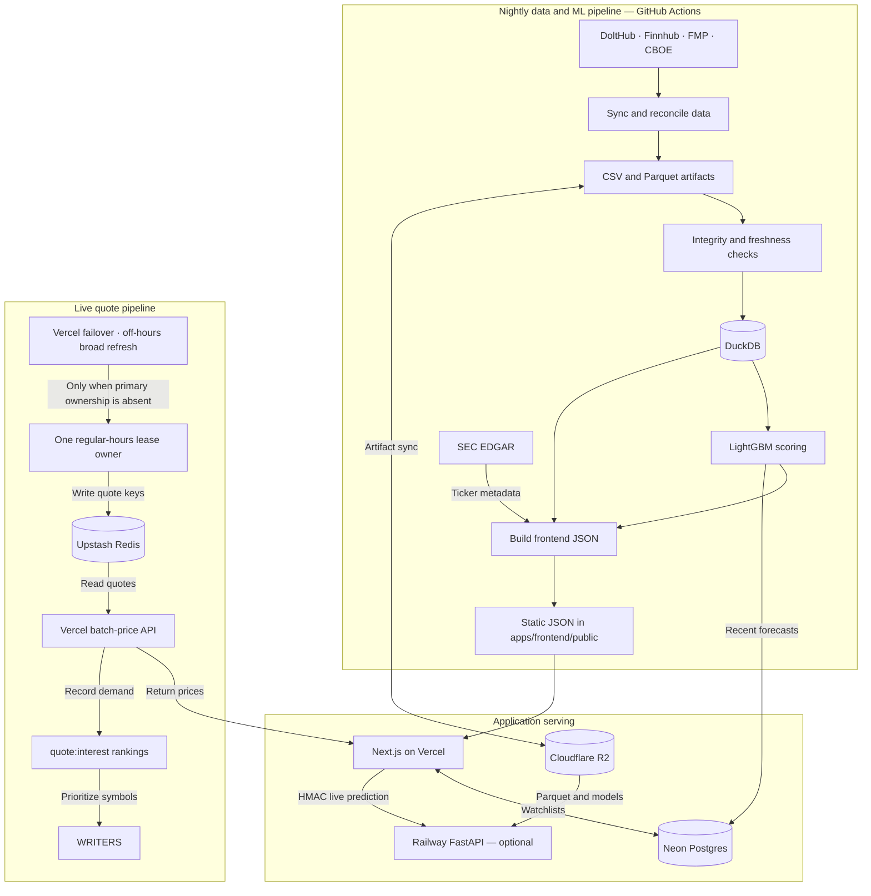

# Quantiv system architecture

This guide documents Quantiv's production data flow, application services, live quote system, and optional ML backend. For installation and common contributor commands, start with the root [README](../README.md).

## Overview

Quantiv has three independent paths:

1. **Static dashboard generation** — scheduled ingestion, validation, scoring, and JSON publication.
2. **Live ML inference** — an optional signed Vercel-to-Railway request path.
3. **Live quotes** — one lease-elected regular-hours writer with explicit fallbacks.



## Static dashboard path

The calendar, screener, and baseline symbol pages are served from generated JSON rather than a FastAPI request on every navigation.

```text
Provider data
→ CSV and Parquet artifacts
→ integrity checks
→ DuckDB views
→ ML scoring
→ frontend JSON
→ Next.js on Vercel
```

Generated assets live under `apps/frontend/public/`, primarily in:

```text
apps/frontend/public/
├── weeks/
├── symbols/
├── screener.json
├── ticker-names.json
└── ticker-exchanges.json
```

Provider outputs are reconciled into `data/earnings_calendar.csv`. The integrity gate must pass before downstream generation proceeds.

## Live ML path

When configured, symbol and watchlist pages can request live re-inference through a signed proxy:

```text
Vercel
→ HMAC-signed request
→ Railway FastAPI
→ persisted Neon feature_vector
→ latest stock-price substitution
→ prediction response
```

The proxy uses `BACKEND_URL` and `BACKEND_SHARED_SECRET`. See [HMAC_PROXY.md](HMAC_PROXY.md) for signing details.

If Railway is unavailable, the frontend can continue displaying ML fields embedded in nightly static JSON.

The only production inference path is:

```text
POST /api/ml/predict
→ predict_service
→ Neon feature_vector
→ signed native LightGBM champion
```

## Live quote path

The quote path uses Upstash keys in the form `quote:{symbol}`. During the
regular quote window, `quote:regular:lease` elects exactly one active writer.

### Writers

1. **Railway quote worker** — preferred lease owner, using Finnhub WebSocket data for high-priority symbols and REST for the long tail.
2. **Vercel `refresh-prices`** — automatic failover. It must acquire the same lease before writing and never runs as a concurrent regular-hours owner.
3. **Vercel `refresh-broad`** — off-hours cache warmup using Polygon grouped-daily data; it is not a competing regular-hours writer.

The Cloudflare Worker only invokes the Vercel failover route. It does not fetch
or write quotes itself.

Client reads go through `/api/stocks/batch-price`. That route reads cached quotes, applies a short in-memory cache, and records context-weighted demand in the `quote:interest` sorted set. The Railway worker reads those rankings to prioritize active symbols.

Protected cron routes use `CRON_SECRET` and `BROAD_REFRESH_SECRET`.

## Services

| Service | Role | Required? |
|---|---|---|
| Vercel | Next.js app, API routes, and static JSON | Yes for hosted web deployment |
| Cloudflare R2 | Parquet datasets and model artifacts | Yes for the hosted data pipeline |
| GitHub Actions | Validation, refresh, publication, and model workflows | Yes for automated refreshes |
| Upstash Redis | Quote cache and interest rankings | Required for live quotes |
| Finnhub | Earnings overlay and regular-hours quote source | Required for the primary quote workflow |
| Clerk | Watchlist and admin authentication | Optional |
| Neon | Watchlists, forecasts, and cron metadata | Optional for public browsing |
| Railway FastAPI | Live ML re-inference from persisted feature vectors | Optional |
| Railway quote worker | Scaled quote ingestion | Optional |
| Polygon | Off-hours broad quote refresh | Optional |
| Alpaca IEX | Intraday bars and selected extended-hours data | Optional |
| Cloudflare Worker | Trigger for the lease-gated Vercel quote fallback | Optional |

Production DNS:

```text
usequantiv.com      → Vercel
api.usequantiv.com  → Railway
```

See [RAILWAY_SETUP.md](RAILWAY_SETUP.md) for deployment instructions.

## Data providers

| Source | Usage |
|---|---|
| DoltHub | Historical earnings-calendar baseline |
| Finnhub | Near-term earnings, profiles, logos, and live quotes |
| Financial Modeling Prep | Earnings, EPS, and revenue enrichment |
| CBOE | Authoritative VIX history |
| SEC EDGAR | Ticker names, exchanges, and company identity metadata |
| Alpaca IEX | Intraday and selected extended-hours prices |
| Polygon | Off-hours broad quote refresh |

## Frontend API routes

| Route | Purpose |
|---|---|
| `/api/stocks/batch-price` | Read cached quotes and record quote demand |
| `/api/stocks/intraday` | Return Alpaca IEX intraday bars |
| `/api/stocks/search` | Search supported stock and ETF metadata |
| `/api/watchlist/*` | Watchlist CRUD and reordering |
| `/api/ml/predict` | Proxy one live prediction to Railway |
| `/api/ml/batch-predict` | Proxy multiple live predictions |
| `/api/ml/status` | Return protected ML diagnostics |
| `/api/cron/refresh-prices` | Refresh regular-hours and selected extended-hours quotes |
| `/api/cron/refresh-broad` | Refresh the broad universe outside market hours |

## Automation

| Workflow | Trigger | Purpose |
|---|---|---|
| `ci.yml` | Pull requests and pushes to `main` | Lint, build, pytest, and Playwright |
| `daily-refresh.yml` | Nightly | Data refresh, scoring, frontend generation, and optional training |
| `refresh-broad.yml` | Weekday off-hours | Polygon quote-cache warming |
| `refresh-ticker-names.yml` | Quarterly | SEC ticker-name and exchange refresh |
| `av-enrichment.yml` | Manual only | Isolated provider-signal research artifact; never writes to `main` |

The nightly workflow broadly performs:

```text
Pull R2 artifacts
→ synchronize core providers and reconcile inputs
→ validate the earnings calendar
→ push Parquet artifacts
→ build DuckDB views
→ score recent observations
→ validate forecasts and publish a content-addressed evidence receipt
→ import forecasts
→ update market-cap and popularity metadata
→ generate frontend JSON
→ commit generated artifacts
→ redeploy Vercel
```

Sunday runs may retrain a signed LightGBM challenger. Mandatory walk-forward,
baseline, calibration, forecast-handoff, common-holdout, and shadow gates decide
a bundle replaces the champion. R2 publishes bundle contents before its signed
pointer. Railway verifies digests, preflights all native models, atomically
activates the exact decision bundle, and writes an activation receipt before
the same-bundle forecast is allowed into Neon. Realized monitoring can sign a
rollback to the previous bundle. See [Model control plane](MODEL_CONTROL_PLANE.md). Saturday runs perform
a Finnhub profile and logo sweep.

ML/model publication is fail-closed and produces a shared run-level evidence
receipt rather than per-value lineage records. See
[Evidence receipts](EVIDENCE_RECEIPTS.md) for the contract and zero-database-cost
publication path.

Experimental vendor signals are frozen across collection, frontend publication,
and ML admission until a pinned paired walk-forward result passes the no-added-
cost policy. See [Provider signal promotion policy](PROVIDER_SIGNAL_POLICY.md).

The data pipeline also emits one exception-first reconciliation manifest from
the existing DuckDB views and mapping files. Critical exceptions block scoring;
warnings expose coverage or instrumentation gaps. See
[Reconciliation control plane](RECONCILIATION_CONTROL_PLANE.md).

## Data behavior and limitations

- Headline expected move is generally straddle- or IV-derived unless an ML result is available.
- ML values may come from nightly static JSON or a successful live Railway prediction.
- Live quotes are cached and may be stale or unavailable when providers or refresh workers are not configured.
- Provider datasets can disagree on announcement dates, timing, EPS, and revenue estimates.
- The integrity gate reduces inconsistencies but cannot guarantee provider accuracy.
- `/public/weekly.json` is a legacy fallback; primary week data lives under `/public/weeks/`.
- The `Popular` filter uses weights from `tools/build_popular_weights.py`, with its threshold configured in `apps/frontend/lib/popular.ts`.
