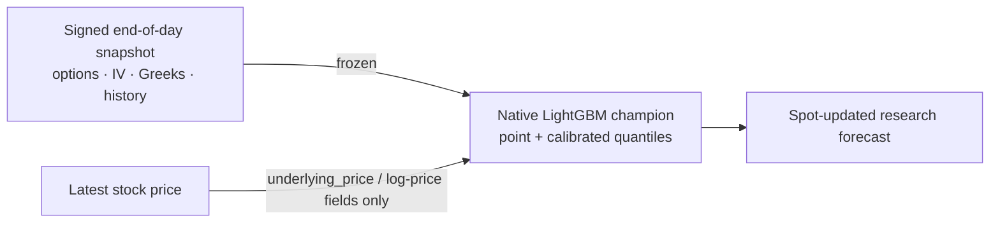

# ML decision scope

Quantiv's model outputs are end-of-day research evidence. A current stock quote can update the model's spot-derived inputs, but it does not make the complete feature set intraday or suitable for order execution.



## Contract

| Property | Nightly mode | Spot-updated mode |
|---|---|---|
| Stock price | Snapshot price | Latest supplied price |
| Options quotes, IV, Greeks, skew, and term structure | Signed snapshot | Same signed snapshot |
| Earnings and historical features | Signed snapshot | Same signed snapshot |
| Model bundle | Signed champion | Same signed champion |
| Decision scope | End-of-day research | End-of-day research |
| Live-trading eligible | No | No |

`POST /api/ml/predict` and each batch item accept only `intended_use: "end_of_day_research"`. A live-trading value is rejected before scoring. A prediction with a supplied stock price carries:

```json
{
  "inference_mode": "spot_updated_snapshot",
  "market_data_mode": "end_of_day",
  "decision_scope": "end_of_day_research",
  "live_trading_eligible": false,
  "updated_inputs": ["spot"]
}
```

An API re-score without a supplied price uses `inference_mode: "snapshot_rescore"` and an empty `updated_inputs` list. Nightly fallback responses use `inference_mode: "nightly_snapshot"`. If a supplied spot only rescales a stored percentage into dollars, `updated_inputs` reports `spot_for_dollar_scaling` rather than implying that the model was re-run.

## Safe interpretation

Use the output to compare earnings-event move estimates, cohorts, and model-versus-straddle evidence after checking freshness and quality status. Do not use it as an executable options quote, an intraday surface, or an order-routing signal. Supporting live trading would require timestamped and synchronized option quotes, bid/ask depth, volume and open interest, latency controls, and execution-aware validation that the current source does not provide.
