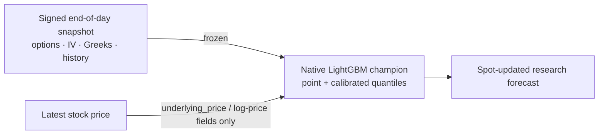

# ML decision scope

Quantiv's model outputs are end-of-day research evidence. A current stock quote can update the model's spot-derived inputs, but it does not make the complete feature set intraday or suitable for order execution.



## Contract

| Property | Nightly mode | Spot-updated mode |
|---|---|---|
| Stock price | Snapshot price | Latest supplied price |
| Options quotes, IV, Greeks, skew, and term structure | Signed snapshot | Same signed snapshot |
| Earnings and historical features | Signed snapshot | Same signed snapshot |
| Model bundle | Signed champion | Same signed champion |
| Decision scope | End-of-day research | End-of-day research |
| Live-trading eligible | No | No |

`POST /api/ml/predict` and each batch item accept only `intended_use: "end_of_day_research"`. A live-trading value is rejected before scoring. A prediction with a supplied stock price carries:

```json
{
  "inference_mode": "spot_updated_snapshot",
  "market_data_mode": "end_of_day",
  "decision_scope": "end_of_day_research",
  "live_trading_eligible": false,
  "updated_inputs": ["spot"]
}
```

An API re-score without a supplied price uses `inference_mode: "snapshot_rescore"` and an empty `updated_inputs` list. Nightly fallback responses use `inference_mode: "nightly_snapshot"`. If a supplied spot only rescales a stored percentage into dollars, `updated_inputs` reports `spot_for_dollar_scaling` rather than implying that the model was re-run.

## Historical event freeze contract

Historical earnings forecasts are governed by an immutable event-prediction ledger rather than by whichever daily file happens to be newest.

For each scored candidate Quantiv stores the event identity, model bundle, exact feature hash, scoring timestamp, feature snapshot timestamp, event-specific feature cutoff, prediction deadline, and option quote timestamps. A row that misses any cutoff remains in the audit ledger but is ineligible to become the frozen historical forecast.

The current policy is:

- **BMO / unknown timing:** feature data may run through the previous canonical NYSE close. The model prediction must exist before midnight ET starting the earnings calendar day, which excludes event-morning rescoring while allowing normal nightly batch processing.
- **AMC:** the target cutoff is five minutes before the canonical event-day close, including early closes. A same-day forecast is eligible only when its inputs carry timestamps proving they existed before that cutoff.
- **Current EOD limitation:** date-only EOD option/OHLCV inputs cannot prove a 15:55 same-day AMC state, so they fail closed. Until synchronized intraday option inputs exist, the final eligible AMC forecast remains the latest prior-session model snapshot rather than pretending a post-close row was pre-event.

The selected frozen headline then follows **ML → IV/options → historical**. The underlying ML and IV evidence are retained separately for model-vs-market analysis.

A separate append-only publication receipt records when a frozen forecast ID first entered generated public artifacts. Neither the prediction ledger nor publication ledger rewrites prior rows.

## Safe interpretation

Use the output to compare earnings-event move estimates, cohorts, and model-versus-straddle evidence after checking freshness and quality status. Do not use it as an executable options quote, an intraday surface, or an order-routing signal. Supporting live trading would require timestamped and synchronized option quotes, bid/ask depth, volume and open interest, latency controls, and execution-aware validation that the current source does not provide.
